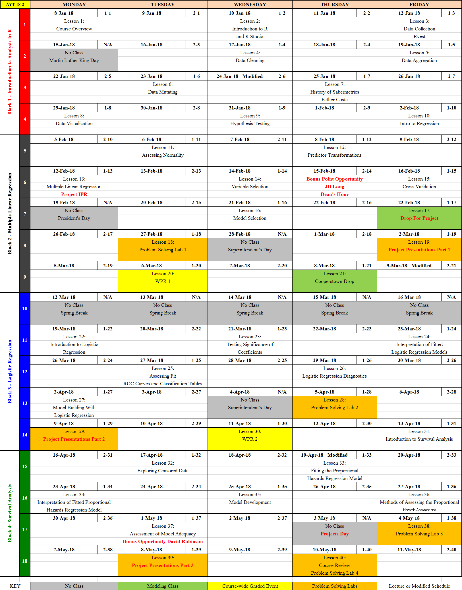
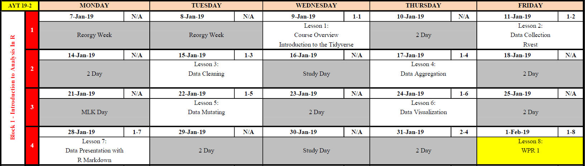
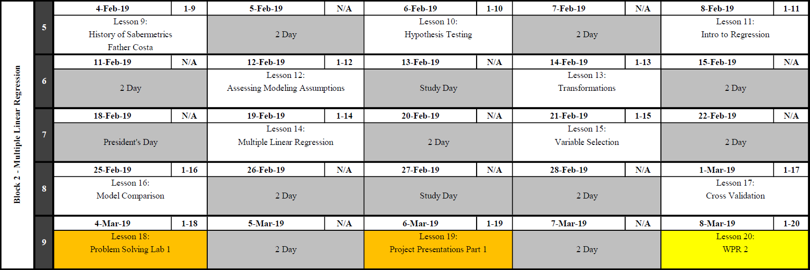
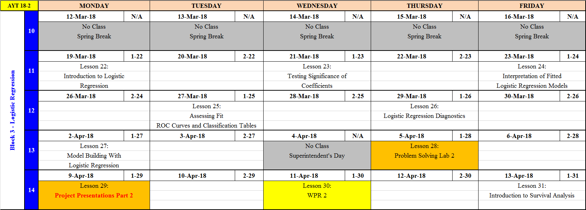
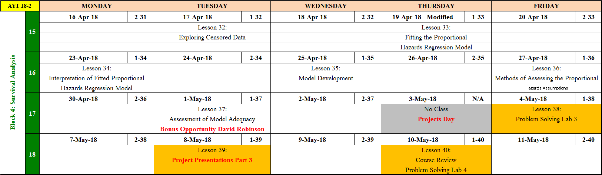

 
```{r setup, include=FALSE}
knitr::opts_chunk$set(echo = TRUE)
```

# Course Admin {#admin} 

Welcome to MA388.  In this course, we will explore model buidling using multiple linear regression, logistic regression, and survival analysis through the world of baseball.

<center></center>

## Course Guide Tips

In the [**Course Admin**](#admin) section, you'll find general information about the course, the overall objectives of the course, and a brief tutorial designed to help you get started using R, the primary technology resource we'll use in MA388.  The course guide is then laid out to match the layout of the course: block by block and lesson by lesson.  

## Course Topics

#### [Block 1: Introduction to Analysis in R](#block1)

#### [Block 2: Multiple Linear Regression](#block2)

#### [Block 3: Logistic Regression](#block3)

#### [Block 4: Survival Analysis](#block4)

## Course Website

The <a href="https://lms.westpoint.edu/math/ma388/SitePages/default.aspx" target="_blank">MA388 Course Webpage</a> provides resources you may find helpful throughout the semester.  

## Instructor Pages  {#instructorpage}

Course Director: **<a href="https://lms.westpoint.edu/math/jason.sharritt/SitePages/Home.aspx" target="_blank">CPT Jay Sharritt</a>** 
<br>
A/Course Director: **<a href="https://lms.westpoint.edu/math/dusty.turner/SitePages/Home.aspx" target="_blank">CPT Dusty Turner</a>**

## Course Textbooks

Since MA206 is a prerequisite, we will use the 9th edition of Jay Devore’s textbook, **Probability and Statistics for Engineering and the Sciences**.  In addition to that we will use the 2nd edition of Jared Lander’s textbook, **R for Everyone**.  Finally we have access to the 2nd edition of the sabermetrics textbook, **Understanding Sabermetrics**¸ written by our own Father Costa and two of his colleagues.  The course guide will be published on the course website, https://lms.westpoint.edu/math/ma388/SitePages/default.aspx

## Course Memo

<a href="https://lms.westpoint.edu/math/ma388/SiteAssets/CD%20Memo%20AY18-02.pdf" target="_blank">MA388 Course Director Memo</a>

## Graded Events

MA388 is a 1000-point course.  

|Event|Points|
|-----------|---|
|Block 2 WPR|200|
|Block 3 WPR|200|
|Instructor Points  |100|
|Course Project |200|
|Term End Exam|300|

## Student Lead Seminars

Your instructor will assign you a date to present a chapter of Father Costa's Book **Understanding Sabermetrics**.  This will be worth a portion of your instructor points.  

## Course Objectives

1. Use the concepts of statistics and probability learned in MA206.

2. Develop proficiency with the open source statistical program R in order to create statistical models and communicate results through visual tools.  

3. Attain, clean, join, and manipulate data in order to prepare it for statistical analysis. 

4. Use advanced modeling and statistical concepts to analyze baseball and other data. 

5. Appreciate the relevance of baseball in utilizing statistical methods by investigating application problems and presenting results.

6. Communicate assumptions, models, and results using technical language in both written and oral formats.

7. Develop the skills to critically synthesize statistical data and analysis from all types of media to in order to develop rational, well informed conclusions and opinions about real world issues.  


## Reference Sheets

The following reference sheets are available on the MA388 Course Guide.  All are authorized references for use during all course-wide assessments unless specifically noted.  You may access them digitally or in hard copy.  A clean hard copy will never count against any notes pages you may otherwise be authorized.

<!-- <a href="https://lms.westpoint.edu/math/ma206/Shared%20Documents/MA206%20Reference%20Sheet.pdf" target="_blank">MA206 REFERENCE SHEET</a>  -->
<!-- <a href="https://lms.westpoint.edu/math/ma206/Shared%20Documents/MA206%20Reference%20Sheet.pdf" target="_blank">Data Tranformation Reference Sheet</a>  -->
<!-- <a href="https://lms.westpoint.edu/math/ma206/Shared%20Documents/MA206%20Reference%20Sheet.pdf" target="_blank">Data Visualization Reference Sheet</a>  -->


#### **<a href="https://lms.westpoint.edu/math/ma388/Images1/MA206%20ReferenceSheet.pdf" target="_blank"> MA206 Reference Sheet</a> **

<center></center>

#### **<a href="https://lms.westpoint.edu/math/ma388/Images1/Data%20Transformation.pdf" target="_blank"> Data Tranformation Reference Sheet</a> **

<center></center>
<center></center>

#### **<a href="https://lms.westpoint.edu/math/ma388/Images1/data-visualization-2.1.pdf" target="_blank"> Data Visualization Reference Sheet</a> **

<center></center>
<center></center>


## Course Calendar
<a href="https://lms.westpoint.edu/math/ma388/Images1/MA256%20Calendar%20AY18-02.pdf" target="_blank">PDF Download of Course Calendar</a>

The course calendar will be updated periodically.  This is current as of `r Sys.Date()`.

<center></center>

***

# Block 1 - Introduction to Analysis in R {#block1}

<center></center>

### Block 1 Objectives

1. Develop proficiency in R and become self sufficient when overcoming coding problems.

2. Attain, clean, join, and manipulate data in order to prepare it for statistical analysis.

3. Create visualizations that provide insight into the data.

4. Develop an appreciation for the history of Sabermetrics.  

***

## Lesson 1 - Course Overview 

1. Complete Administrative Tasks

2. Review the Academic Integrity Brief

3. [Find your instructor's MA388 page for specific day 1 instructions](#instructorpage)

|Familiarize|Watch|Suggested Problems|
|-------------------|-----------------|-----------|
|Lander Chapter 1-2 |  | Instructor Specific | 

***

## Lesson 2 - Introduction to R and R Studio 

1. Install R and R Studio 

2. Download R Packages from the Comprehensive R Archive Network (CRAN)

3. Read data into R from a CSV file.

4. Understand Data Structures and basic R operations.  

|Familiarize|Watch|Suggested Problems|
|-------------------|-----------------|-----------|
|Lander Chapter 3-6.2 |  | Suggested Problems Below | 

### Suggested Problems:

1. Install `tidyverse`.

2. Read in the `batting256.csv` file from the course sharepoint page.

3. Summaries the data.  What data seems relevant for analysis. Irrelevant? How would you know?

4. Create several plots that you might find interesting.

5. Which player has played the most games? Registered the least hits?  What else do you find interesting?

### R Help

Helpful commands

```{r echo=TRUE, message=FALSE, warning=FALSE}
# install.packages("tidyverse")  Execute this line without the '#' to install the tidyverse
# library(tidyverse) execute this line everytime you restart R to access this package
# getwd() 
# setwd(C:/Users/first.last/Desktop/.../)  Notice that the '\' are backwards '/'.  
# batting = read_csv("batting256.csv") be sure this file is in the working directory
# summary(data)  
# plot(data$y1~data$x1)
# data[which.max(data$X1),]
```


***

## Lesson 3 - Data Collection using RVest

1. Install packages and addons to aid data collection.

2. Understand ethical responsibilities of data scraping.

3. Successfully 'scrape' data from the internet using R

|Familiarize|Watch|Suggested Problems|
|-------------------|-----------------|-----------|
|Lander Chapter 6.7-6.9 |  | Suggested Problems Below | 
|<a href="https://blog.rstudio.com/2014/11/24/rvest-easy-web-scraping-with-r/" target="_blank">Web Scraping How To</a>|||


### Suggested Problems

1. Install the <a href="http://selectorgadget.com/" target="_blank">Selector Gadget</a> tool.  
  - You must use Chrome
  - Find the part of the page that says "Or drag this link to your bookmark bar."  Drag the link to the book mark bar.
  - Test that it has installed properly by clicking on the bookmark.  You will know its a success when a box appears in the bottom right corner of your browser and your screen begins to highlight where your mouse rests. 
  - Click on the data of interest on the website to select the proper CSS tag.  

2. Install the `rvest` package using the `install.packages("rvest")` command.

3. 'Scrape' the batting statistics from the <a href="https://www.baseball-reference.com/teams/TEX/2017.shtml" target="_blank">Texas Ranger's</a> page at Baseball Reference.  

4.  Create plot hits vs batting average.  Create other plots that help you visualize the data.

5. Summaries the data.  Who lead the team in RBIs?  Hits?  Strikeouts? Of players who has at least 50 plate appearances, who had the highest batting average?  

6. What issues did you run into during this process?  What was harder: Getting the data or getting the data in a usable format to analyse the data?

### R Help

Install / Load `rvest`
```{r echo=TRUE, message=FALSE, warning=FALSE}
# install.packages("rvest")  
library(rvest)
```

Scrape Data
```{r echo=TRUE, message=FALSE, warning=FALSE}
# Store the URL as a variable
url <- read_html("https://www.baseball-reference.com/teams/TEX/2017.shtml")

#Scrape the website for information.  Use the CSS Selector tool to attain the proper CSS header.
rangers <- url %>% 
  html_nodes("#team_batting .center , #team_batting .left, #team_batting .right") %>%
  html_text()

texas = matrix(rangers, ncol = 28, byrow = TRUE)
texas = as.data.frame(texas)
texas = unique(texas)
colnames(texas) = as.character(unlist(texas[1,]))
texas = texas[-1,]
```

You can now use this information to answer the suggested problems.  

***

## Lesson 4 - Data Cleaning

1. Join multiple data tables.

2. Subset data by...
  - random selection.
  - criteria of columns.
  - row position.
  - variable extraction.
  
3. Save data to a csv file. 
  
|Familiarize|Watch|Suggested Problems|
|-------------------|-----------------|-----------|
|Lander Chapter 12.1-12.5, 15 |  | Suggested Problems Below | 

### Suggested Problems

1. Read in the `fielding`, `batting`, and `pitching` data from the course share point site.  

2. 'Join' the the tables together using a full join.  Join the tables on columns such that you do not duplicate data.

3. Select all rows which occurred since 1975.

4. Rename Column headers so that they are easier to understand.

5. Filter the data by playerID, yearID, AB, GamesBatting, GamesField, SBBatting, CSBatting, and HBatting.

6. What is the average hits per season per player since 1975?

<center>{ width=50% }</center>

### R Help 1

**The "PIPE" Tool**:  Using the `tidyverse` gives us the useful tool `%>%` - called the pipe.  A pipe allows us to 'pipe' arguments into functions is a very fluid way -- one that can simplify our coding.  Look at the function below:

```{r echo=TRUE}
myfunction = function(x,y){
  z=x*y
  return(z)
}
```

To use this function, you place arguments in it like you have previously in MA206.  For example:

```{r echo=TRUE}
myfunction(3,4)
```

The `%>%` allows us to pipe in the first argument into our function.  See below:

```{r echo=TRUE}
3 %>% myfunction(4)
```

You can also string many functions together with the pipe.

```{r echo=TRUE}
3 %>% myfunction(4) %>% myfunction(10)
```

The above vignette is a simple application.  You will see next, an throughout the course, the many benefits of 'piping' in R.  

### R Help 2

Use `names(data)` to get a list of the names of your data.

```{r echo=TRUE, message=FALSE, warning=FALSE}
library(tidyverse)
fielding = read_csv("Fielding.csv")
batting = read_csv("Batting.csv")
pitching = read_csv("Pitching.csv")

fieldandbat = 
  fielding %>%
  full_join(batting, by = c("playerID", "yearID", "stint", "teamID", "lgID"))

fieldbatandpitch = 
  fieldandbat %>%
  full_join(pitching, by = c("playerID", "yearID", "stint","teamID", "lgID"))

fieldbatandpitch =
  fieldbatandpitch %>%
  filter(yearID >= 1975)

players = 
  fieldbatandpitch %>% 
  rename(GamesBatting = G.x, GamesField = G.y, GamesStartedField = GS.x, GamesStartedPitching = GS.y, WPFielding = WP.x, 
         SBBatting = SB.x, SBFielding = SB.y, CSBatting = CS.x, CSFielding = CS.y, RBatting = R.x,
         RPitching = R.y, HBatting = H.x, HPitching = H.y, HRBatting = HR.x, HRPitching = HR.y, 
         BBBatting = BB.x, BBPitching = BB.y, SOBatting = SO.x, SOPitching = SO.y, IBBBatting = IBB.x,
         IBBPitching = IBB.y, HBPBatting = HBP.x, HBPPitching = HBP.y, SHBatting = SH.x, SHPitching = SH.y,
         SFBatting = SF.x, SFPitching = SF.y, GIDPBatting = GIDP.x, GIDPPitching = GIDP.y, GPitching = G) 

playersselected = 
  players %>%
  select(playerID, yearID, AB, GamesBatting, GamesField, SBBatting, CSBatting, HBatting)

# mean(playersselected$AB)

write.csv(playersselected, "players.csv")
```


***

## Lesson 5 - Data Aggregation 

1. Know when data aggregation is necessary to support analysis.     

2. Arrange data by specific column names.

3. Group columns on particular traits in preparation for aggregation. 

4. Apply the following (non exhaustive list of) aggregation techniques across grouped variables:
  - sum() / count()
  - mean() / median() / sd() / var()
  - min() / max() / quantile()
  - others from Data Transformation Cheat Sheet

|Familiarize|Watch|Suggested Problems|
|-------------------|-----------------|-----------|
|Lander Chapter 12.7-12.9 |  | Suggested Problems Below | 

### Suggested Problems

1. Read in data from last lesson: `players.csv`

2. What is the average at bats per season?

3. Group by year.  What is the average at bats per year?

4. Group by player and year.  Which player had the most at bats in a year?  Which year was it?

5. Group by year.  Arrange the data from most to least by stolen bases.  Who stole the most bases?  How many times was that player caught stealing?  

### R Help

```{r echo=TRUE, message=FALSE, warning=FALSE, results='hide'}
library(tidyverse)

# 1. Read in data from last lesson: `players.csv`
players = read_csv("players.csv")

# 2. What is the average at bats per season?
players %>%
  summarise(mean(AB))

# 3. Group by year.  What is the average at bats per year?
players %>%
  group_by(yearID) %>%
  summarise(mean(AB))

# 4. Group by player and year.  Which player had the most at bats in a year?  Which year was it?
players %>% 
  group_by(yearID, playerID) %>%
  arrange(desc(AB))

# 5. Group by year.  Who stole the most bases?  How many times was that player caught stealing?  
players %>%
  group_by(yearID) %>%
  arrange(desc(SBBatting))
```


***
## Lesson 6 - Data Mutating 

|Familiarize|Watch|Suggested Problems|
|-------------------|-----------------|-----------|
|Lander Chapter 12.6 | | Suggested Problems Below | 

1. Know when data mutation is necessary to support analysis.     

2. Apply the following (non exhaustive list of) mutation techniques across variables:
  - sum() / count() 
  - multiply or divide columns
  - ifelse statements to create binary columns 
  
### Suggested Problems

1. Read in data from last lesson: `players.csv`

2. Filter out players who did not attempt a stolen base in a year.  

3. Create a column that tracks attempted steals.  

4. Grouping by year and player. With a minimum of 10 steals in a season, what 5 players have the highest success rate?
 
### R Help 
  
```{r echo=TRUE, message=FALSE, warning=FALSE, results='hide'}
library(tidyverse)

# 1. Read in data from last lesson: `players.csv`
players = read_csv("players.csv")

# 2. Filter out players who did not attempt a stolen base in a year.  

players2 = players %>%
  filter(!is.na(SBBatting)&!is.na(CSBatting))

# 3. Create a column that tracks attempted steals.  

players3 = players2 %>%
  mutate(totalsteals = SBBatting + CSBatting)

# 4. Grouping by year and player. With a minimum of 10 steals in a season, what 5 players have the highest success rate?

players3 %>%
  group_by(yearID, playerID) %>%
  mutate(successrate = SBBatting/totalsteals) %>%
  filter(totalsteals>=25) %>%
  arrange(desc(successrate)) %>%
  ungroup() %>%
  top_n(5,successrate)
  
```


***

## Lesson 7 - History of Sabermetrics by Father Costa 

1. Understand the history of Sabermetrics.  

|Familiarize|Watch|Suggested Problems|
|-------------------|-----------------|-----------|
| |  |  | 

***

## Lesson 8 - Data Visualization

1. Become proficient plotting with ggplot2 in R.

2. Plot data to discover relationships between columns of data.

3. Use graphics to 'tell the story' of the data.

|Familiarize|Watch|Suggested Problems|
|-------------------|-----------------|-----------|
|Lander Chapter 7 |  | Suggested Problems Below | 

### Suggested Problems

1. Using `players.csv`, plot a histogram of every athlete's career hits.

2. Is there a relationship between games played and hits?

3. How about career games played, hits, and steals?

4. Create the plot above, but facet by year since 2008.

5. Create labels and titles that make the plot appealing.

6. Using your creativity, create several other plots that tell the story of the data.

### R Help

```{r echo=TRUE, message=FALSE, warning=FALSE, results='hide'}
library(tidyverse)

# 1. Using `players.csv`, plot a histogram of every athlete's career hits.
players = read_csv("players.csv")

plotter = players %>%
  group_by(playerID) %>%
  summarise(careerhits = sum(HBatting))

ggplot(data = plotter, aes(x=careerhits)) +
  geom_histogram()

# 2. Is there a relationship between games played and hits?

plotter = players %>%
  group_by(playerID) %>%
  summarise(careerhits = sum(HBatting), careeratbats = sum(AB))
  
ggplot(data = plotter, aes(x=careeratbats, y=careerhits)) +
  geom_point()

# 3. How about career games played, hits, and steals?

plotter = players %>%
  group_by(playerID) %>%
  summarise(careerhits = sum(HBatting), careeratbats = sum(AB), careersteals = sum(SBBatting))
  
ggplot(data = plotter, aes(x = careeratbats, y = careerhits, color = careersteals)) +
  geom_point()

# 4. Create the plot above, but facet by year since 2008.

plotter = players %>%
  filter(yearID>2007)
  
ggplot(data = plotter, aes(x = AB, y = HBatting, color = SBBatting)) +
  geom_point() +
  facet_wrap("yearID")

# 5. Create labels and titles that make the plot appealing.

ggplot(data = plotter, aes(x = AB, y = HBatting, color = SBBatting)) +
  geom_point() +
  facet_wrap("yearID") +
  labs(title = "Number of Hits vs At Bats by Year since 2008", y = "Hits",
       x = "At Bats", color = "Stolen Bases")


```


***

# Block 2 - Multiple Linear Regression {#block2}

<center></center>


***

### Block 2 Objectives

1. Understand problems that linear regression can inform.  

2. Understand the model building process.

3. Know the assumptions necessary to perform linear regression.

4. Take measures to transform data when linear modeling assumptions are violated.  


## Lesson 9 - Hypothesis Testing

1. Explain the purpose of conducting a hypothesis test.

2. Explain the two types of error associated with hypothesis testing and the relationship between the two types.

|Familiarize|Watch|Suggested Problems|
|-------------------|-----------------|-----------|
|Devore 8.1, | **<a href="https://www.youtube.com/watch?v=cpL38ZeIecE" target="_blank">Hypothesis Testing</a>** | Suggested Problems Below | 
|Supplemental Material|**<a href="https://www.khanacademy.org/math/probability/statistics-inferential/hypothesis-testing/v/type-1-errors"target="_blank">Type I Error</a>** ||

Supplemental Material: P-Value -- The p-value is the probability of obtaining the observed test statistic (or a more extreme result) when the null hypothesis is actually true. More simply stated, how rare is what I just saw if I assume the null hypothesis to be true?

***
### Suggested Problems

1. What is the definition of a Type I error?  What about a Type II error?

2. How is alpha and beta related to the question above?

3. Relative to the steroids question, what hypotheses could we make?

4. What are the type I and II errors related to the question above?

5. Which is more dangerous, a type I or type II error?

***

## Lesson 10 - Intro to Regression 

1. Describe when a linear model is useful.

2. Given a response variable; develop and assess linear regression models to explain its variation using continuous predictors.

3. Interpret model parameters of the linear regression model.

4. Describe the necessary model assumptions for a valid linear regression model.

|Familiarize|Watch|Suggested Problems|
|-------------------|-----------------|-----------|
|Reading |**<a href="https://www.youtube.com/watch?v=66z_MRwtFJM" target="_blank">SLR in R</a>**| Suggested Problems Below | 
||**<a href="https://www.khanacademy.org/math/probability/regression" target="_blank">Khan Academy Video - Regression</a>**

***
### Suggested Problems

1. Using `players.csv`, investigate the relationship between a player's 2Bs and steals.

2. Is there a relationship between years and steals?

3. How much variation is explained by the either of those models?

4. Are there better single predictors for steals?

***

## Lesson 11 - Assessing Normality 

1. Explain the benefits of using a Normal Probability Plot vs. a Histogram.

2. Create a Normal Probability plot in R.

|Familiarize|Watch|Suggested Problems|
|-------------------|-----------------|-----------|
|Reading |**<a href="http://www.r-tutor.com/elementary-statistics/simple-linear-regression/normal-probability-plot-residuals" target="_blank">R-Tutor: Normal Probability Plots</a>**| Problems | 

***

## Lesson 12 - Predictor Transformations 

1. Explain the reasoning behind the need to transform data when creating regression models. 

2. Compute multiple data transformations on Simple Linear Regression models.

3. Explain the “Bulging Rule” as a method for identifying possible appropriate transformations.

|Familiarize|Watch|Suggested Problems|
|-------------------|-----------------|-----------|
|Reading |**<a href="https://www.youtube.com/watch?v=HIcqQhn3vSM" target="_blank">Transformations</a>** | Problems | 


***

## Lesson 13 - Multiple Linear Regression

1. Given a response variable, develop multiple linear regression models to explain its variation using continuous and categorical predictors.

2. Use R to perform multiple regression using quantitative and categorical predictors.

|Familiarize|Watch|Suggested Problems|
|-------------------|-----------------|-----------|
|Reading | **<a href="https://www.youtube.com/watch?v=q1RD5ECsSB0 " target="_blank">MLR in R</a>** | Problems | 

***

## Lesson 14 - Variable Selection

1. Given a response variable, develop and ASSESS multiple linear regression models to explain its variation using continuous and categorical predictors.

2. Define the coefficient of determination and explain how it is used in evaluating regression models.

3. Apply variable selection techniques.

|Familiarize|Watch|Suggested Problems|
|-------------------|-----------------|-----------|
|Reading |**<a href="http://www.r-tutor.com/elementary-statistics/multiple-linear-regression/multiple-coefficient-determination " target="_blank">R-Tutor: R Squared</a>** | Problems | 

***

## Lesson 15 - Cross Validation

1. Objective 1

2. Objective 2

|Familiarize|Watch|Suggested Problems|
|-------------------|-----------------|-----------|
|Reading |**<a href=" " target="_blank">SLR in R</a>** | Problems | 


**<a href=" " target="_blank">SLR in R</a>**

***

## Lesson 16 - Model Selection

1. Objective 1

2. Objective 2

|Familiarize|Watch|Suggested Problems|
|-------------------|-----------------|-----------|
|Reading | Video | Problems | 

***

## Lesson 17 - Drop For Project 


***

## Lesson 18 - Problem Solving Lab 1

|Familiarize|Watch|Suggested Problems|
|-------------------|-----------------|-----------|
| |  | Instructor Specific | 

***

## Lesson 19 - Project Presentations: Linear Models

The presentation schedule will be posted by your instructor.

***

## Lesson 20 - WPR1 Instructions

### Authorized References:

Specific references will be published by the course director before the WPR.

***

# Block 3 - Logistic Regression {#block3}

<center></center>

### Block 3 Objectives

1. Understand problems that logistic regression can inform.  

2. Understand the model building process for logistic regression.

3. Know the assumptions necessary to perform logistic regression.

4. Become a knowledgeable consumer of statistical information.  

***


## Lesson 21 - Introduction to Logistic Regression Part I

1. Recognize types of problems that can be informed by logistic regression and when the method should and should not be applied.

2. Understand assumptions necessary for logistic regression. 

3. Define the logistic regression model.


|Familiarize|Watch|Suggested Problems|
|-------------------|-----------------|-----------|
|Supplemental Reading Below |  | Suggested Problems Below | 

### Supplemental Reading

First create the following dataframe from the `HallofFame.csv`, `Fielding.csv`, and `Batting.csv` files provided on the course website.

```{r message=FALSE, warning=FALSE}
library(tidyverse)
hof = read_csv("HallOfFame.csv") %>%
  filter(inducted == "Y") %>% 
  select(playerID, inducted)

fielding = read_csv("Fielding.csv") %>%
  select(playerID, yearID, POS, G, PO, A, E, DP) %>%
  filter(POS!="P")

batting = read_csv("Batting.csv") %>%
  select(playerID, yearID, G, AB, R, H, `2B`, `3B`, HR, RBI, SB, BB, SO) %>%
  filter(yearID >1911)

joined = fielding %>%
  inner_join(batting, by = c("playerID", "yearID") ,suffix = c(".fielding", ".batting")) 

careerstats = joined %>% group_by(playerID) %>%
  select(-POS, -yearID) %>%
  summarise_all(funs(sum)) %>%
  left_join(hof)

maxyear = joined %>%
  select(playerID, yearID) %>% group_by(playerID) %>%
  arrange(playerID, yearID) %>%
  summarise(lastyear = max(yearID))

primaryposition = joined %>% group_by(playerID, POS) %>% select(playerID, yearID,G.fielding,POS) %>%
  arrange(playerID) %>%
  summarise(gamesatprimarypos = sum(G.fielding)) %>% group_by(playerID) %>%
  arrange(playerID, desc(gamesatprimarypos)) %>%
  slice(1)
  
hofdata = careerstats %>%
left_join(maxyear) %>% 
  left_join(primaryposition) %>%
  mutate(HOF = ifelse(is.na(inducted),0,1)) %>%
  select(-inducted)
```
### Suggested Problems

1. Create a pairwise plot of the `hof` data.

2. Create a linear model to predict if a player makes it into the Hall of Fame.  Use HOF as the 'predicted' variable and 'AB' and 'HR' as the 'predictors.'

3. What are the issues you see with this model?

### Necessary Assumptions for Logistic Regression:

1. The dependent variable should be dichotomous (ie 0/1, Y/N, present/absent).

2. There should be no high correlations (multicollinearity) among the predictors.  You can assess this by looking at the pairs plot or creating a correlation matrix.  

### The Logistic Regression Model.

Do your best to define each term.  Your instructor will go into details in class.

$log(\frac{p}{1-p}) = \beta_0 + \beta_{x1} + \beta_{x2} + ... + \beta_{xn}$

The right hand side of this equation should look familiar.  The right hand side of this equation is called the 'logit' or the log odds.  The `beta` coefficients, instead of being calculated by the least squares method are created via the maximum likelihood.

***

## Lesson 22 - Introduction to Logistic Regression Part II

1. Create a logistic regression model in R.

2. Explain the log-odds, odds, and probability from a logistic regression model.

|Familiarize|Watch|Suggested Problems|
|-------------------|-----------------|-----------|
|Supplemental reading below |  | Suggested Problems Below | 

### Suggested Problems

1. Define each portion of the logistic regression equation below.  Is the right side linear or non linear?  Is the left side linear or non linear? What does one unit change in $x1$ mean?

$log(\frac{p}{1-p}) = \beta_0 + \beta_{x1} + \beta_{x2} + ... + \beta_{xn}$

2. Define each portion of the logistic regression equation below.  Is either side linear?  What does one unit change in $x1$ mean?

$\frac{p}{1-p} = e^{\beta_0 + \beta_{x1} + \beta_{x2} + ... + \beta_{xn}}$

3. Define each portion of the logistic regression equation below.  Is either side linear?  

$p = \frac{e^{\beta_0 + \beta_{x1} + \beta_{x2} + ... + \beta_{xn}}}{1+e^{\beta_0 + \beta_{x1} + \beta_{x2} + ... + \beta_{xn}}$

### Suplimental Reading

Here is how to create a logistic regression model in R.

```{r message=FALSE, warning=FALSE}
options(scipen = 999)
logisticmod = glm(HOF~HR+RBI+lastyear+POS,data = hofdata, family = binomial(link="logit"))
summary(logisticmod)
```

For every one unit change in HRs, the log odds of making the Hall of Fame increases by $.0000640$.

To see how it impact the odds, we can also look at it this way:

```{r message=FALSE, warning=FALSE}
exp(coef(logisticmod))
```

For every one unit change in HR, the odds of making the HOF increases by $e^{\beta_1}$ or $e^{.0000640}$

***

## Lesson 23 - Model Building with Logistic Regresion Models

1. Understand purposeful selection and execute it in building logistic models in R.

|Familiarize|Watch|Suggested Problems|
|-------------------|-----------------|-----------|
|Supplemental reading below |  | Suggested Problems Below | 

### Supplimental Reading

The following is the purposeful selection method for logistic regression.  Use this for all model building techniques in class for logistic regression.  This is a variation of the purposeful selection method provided by Hosmer/Lemeshow/Sturdivant.

1. Fit all univariate models.  IE, Each predictor vs the 1/0 response variable.

2. Check for multicolinearity between all candidate predictors.  Remove one of the variables that are highly colinear.

3. For all models whose P values fall below a certain threshold and that are not highly colinear, move those to a multivariate model.

4. Remove one variable at a time whose P Value is largest and is above a predetermined alpha.  
  a. After removing each variable, determine if any betas changed signs or if the magnitude of the beta changed greatly.  
  b. If one of the above situation happens, check for multicolinearity between remaining variables.  Move to step 2. 
  
5. Once you have removed all multicolinear variables and all P values are below the predetermined alpha, place removed variables back into the model one at a time to determine if they happen to be significant at this point.

6. This is your final model.  


### Suggested Problems

1. Conduct purposeful selection with the HOF data with 6 predictors of your choice.  

***

## Lesson 24 - Assessing Fit: ROC Curves and Classification

1. From a logistic regression model, create a ROC Curve and understand its implications.

2. Produce the "Area Under the Curve" and interpret its meaning.

|Familiarize|Watch|Suggested Problems|
|-------------------|-----------------|-----------|
|Supplemental reading below |  | Suggested Problems Below |

### Supplemental Reading

Lets use the model below to build a Receiver Operator Characteristic curve and analyse the Area Under the Curve 

```{r message=FALSE, warning=FALSE}
logisticmod = glm(HOF~RBI+lastyear+POS,data = hofdata, family = binomial(link="logit"))
summary(logisticmod)
names(hofdata)
```

Using this model, we can "predict" a probability that an individual makes it to the HOF.

```{r message=FALSE, warning=FALSE}
hofpred = predict.glm(logisticmod, newdata = hofdata, type = "response")
head(hofpred)
```

This is the first six probabilities according to our model.  The first person (Hank Aaron), has a 98% chance of making the hall of fame.  The rest... not so much.  

We need to determine a "cut point" such that everyone above the cut point is considered in the hall of fame and everyone below the cut point is below.  We have two tools to do this.

First, we have the ROC curve.  This 'curve' is an overall measure for how good our model does at discriminating between our 1/0s.

We also must download the `ROCR` library.

```{r message=FALSE, warning=FALSE}
library(ROCR)
pred = prediction(hofpred,hofdata$HOF)
roc.perf = performance(pred, measure = "tpr", x.measure = "fpr")
plot(roc.perf)
abline(a=0, b= 1)
```

The goal here is to have a very steep curve.  When the False Positive rate is relatively low, we have a large true positive rate.  

To determine the quality of our discrimination, we'll look at the Area Under the Curve

```{r message=FALSE, warning=FALSE}
auc.perf = performance(pred, measure = "auc")
auc.perf@y.values
```

This shows that the model does a good job distinguishing between who make and who does not make the hall of fame.  This metric can be misleading though, and we'll discuss that in class.

### Suggested Problems

1.  Create the ROC Curve for the final model you created at the end of the previous lesson.

2.  Calculate the AUC for the same model. 

***

## Lesson 25 - Assessing Fit: Sensitivity and Specificity

1. Produce and interpret a models sensitivity and specificity.

2. Determine the optimal cut point for your model according to stated goals.

|Familiarize|Watch|Suggested Problems|
|-------------------|-----------------|-----------|
|Supplemental reading below |  | Suggested Problems Below |

***

### Suggested Reading

We will further explore the best cut point by exploring sensitivity and specificity in a confusion matrix.

Lets create an arbitrary cut point of .5.  In other words, if our model predicts a .5 or greater probability of being in the hall of fame, we'll classify them as being in the hall of fame.  If below .5, we'll consider them not in the HOF.  

```{r message=FALSE, warning=FALSE}
cut = ifelse(hofpred>.5,1,0)
sum(cut)
```

You can see that we only predicted 50 players from history to be in the HOF, so we are under-predicting.  But lets take a deeper look by creating a confusion matrix.  

You will need to install the caret library to do this.

```{r message=FALSE, warning=FALSE}
library(caret)
confusionMatrix(cut, hofdata$HOF)
```

We can tell from the confusion matrix that we correctly classified at not in the HOF 8040 players and correctly classified in the hall of fame 27 players.  However, we incorrectly predicted 23 players as being in the hall of fame and also incorrectly predicted 135 players as not being in the hall of fame.  

We were 98% accurate, which sounds nice but we also need to consider that if we just said no one was in the hall of fame that we'd get a pretty high percentage correct.  So the accuracy rate shouldn't be taken as the end all statistic.  

Sensitivity is the true positive rate.

Specificity is the true negative rate.

We are pretty good at getting our true positives correct (sensitivity) by correctly identifying who should be in the HOF.

We are pretty bad at the true negative rage (specificity) by poorly identifying who should be classified as not being in the HOF.

Lets find a better cut point by iterating over many possible cut points and identifying which one maximizes accuracy and see how that does. 

```{r message=FALSE, warning=FALSE}
accuracy = NA
for (i in 1:100) {
  temp = ifelse(hofpred>i/100,1,0)
  cm = confusionMatrix(temp, hofdata$HOF)
  accuracy[i] = cm$overall['Accuracy']
  # print(i)
  # print(cm$overall['Accuracy'])
}
trackerdf = data.frame(index = 1:100, accuracy = accuracy)
trackerdf$index[which.max(trackerdf$accuracy)]
```

This shows that the accuracy is maximized when the cut points is a .87.

```{r message=FALSE, warning=FALSE}
cut = ifelse(hofpred>.87,1,0)
confusionMatrix(cut, hofdata$HOF)
```

As you can see, this is not ideal and we will improve off this in class.

### Suggested Problems

1. Using the model you built in previous lessons, find the ideal cut point using these methods.

2. Discuss your models sensitivity and specificity.  Put these in terms of a real world take away.  

***

## Lesson 26 - Model Comparison in Logistic Regression

1. Understand what a model's 'deviance' and understand the 'likelihood ratio test.'

2. Given two models, determine which model is the "better" model.

3. Understand and implement the Hosmer Lemeshow Goodness of Fit Test.

|Familiarize|Watch|Suggested Problems|
|-------------------|-----------------|-----------|
|Supplemental reading below |  | Suggested Problems Below |

Look at the output below.  You should notice the null and residual deviance.  

```{r message=FALSE, warning=FALSE}
logisticmod = glm(HOF~HR+lastyear+POS,data = hofdata, family = binomial(link="logit"))
summary(logisticmod)
```

Deviance is similar to the F statistic in linear regression in practice.  Sparing the details, it is a measure off how far off the probability estimates are from actually being a correct 1 or 0.  The further off (and the more data points that exist), the larger the deviance.

As you can see in the model above, there is a null and residual deviance.  The null deviance is the deviance when only the intercept is considered.  The residual deviance is the deviance of when other predictors are added.  An ideal deviance is 0, but a "large" deviance should not be immediately taken to assume that your model is bad (as deviance grows based on the number of samples in your model).

For this class, a simple comparison of deviance between two models will be sufficient to compare models.  

We will also need a metric to determine if our model fits our data well.  The Hosmer Lemeshow Test will do this.

The Hosmer Lemeshow Tests whether a model fits the data.  The null hypothesis is "The Model Fits Well".  The alternate hypothesis is "Does the model not fit well."

The further the model is from accurately portraying the actual data, the worse the deviance is.  The higher the deviance, the more extreme we are along the test statistic distribution (Chi-Square).

You will need the `ResourcesSelection` library to conduct this test.

```{r message=FALSE, warning=FALSE}
library(ResourceSelection)
hoslem.test(hofdata$HOF,hofpred)
```

Because the P Value is high, we do not have enough evidence to reject the null hypothesis (that the model fits well) and we assume that the model fits the data well.  

***

## Lesson 27 - Problem Solving Lab 2 

1. Specific instructions will be provided by your instructor prior to class.  

|Familiarize|Watch|Suggested Problems|
|-------------------|-----------------|-----------|
|Reading | Video | Problems | 

***

## Lesson 28 - Cooperstown Drop

***

## Lesson 29 - Project Presentations: Logistic Regression

The presentation schedule will be posted by your instructor.

***

## Lesson 30 - WPR2 Instructions

### Authorized References:

Specific references will be published by the course director before the WPR.

***

# Block 4 - Survival Analysis {#block4}

<center></center>

### Block 4 Objectives

1. Understand problems that survival analysis can inform.  

2. Understand the model building process for survival analysis

3. Know the assumptions necessary to perform survival analysis

4. Take measures to transform data when survival analysis modeling assumptions are violated.  

***

## Lesson 31 - Introduction to Survival Analysis: Exploring Censored Data

1. Understand the types of problems survival analysis can inform.

2. Understand the assumptions necessary for survival analysis.

3. Identify the different types of censored data.

|Familiarize|Watch|Suggested Problems|
|-------------------|-----------------|-----------|
|Lander 20.4 | | Suggested Problems Below | 

There are two assumptions necessary for Survival Analysis:

1. *Non-informative censoring* (explored this lesson).

2. *Propotional hazards* (explored in future lessons).

### Suggested Problems

Between the Lander reading and your own internet research, answer the following questions.  

1. Why is Survival Analysis useful?  Why non linear regression?  

  - Logically?  
  - Mathematically? 

2. What does *Non-informative censoring* mean and why is this assumption necessary?

3. Think of a baseball related example of...

 - left censoring
 - interval censoring
 - right censoring

4. Think of 2 baseball related problems you could model with Survival Analysis and 2 non baseball problems.  


***

## Lesson 32 - The Survival Function: The Kaplan-Meier Estimate

1. Understand how a survival function is necessary for survival analysis.

2. Understand the Kaplan-Meier estimate and know how to calculate it by hand and in R. 

3. Calculate quartile estimates of survival for the Kaplan-Meier estimate.  

|Familiarize|Watch|Suggested Problems|
|-------------------|-----------------|-----------|
|Lander 20.4 |  | Suggested Problems Below | 
|Supplemental Reading |  |  | 

### Supplimental Reading

Kaplan-Meier Estimate

Let the number at risk of dying at $t_{(i)}$ be denoted $n_{i}$ and the observed number of deaths be denoted $d_{i}$.

We then obtain the Kaplan-Meier estimator of the survivorship function at time $t$ from the equation.

$\hat{S}(t)=\prod_{t_{i}<t}\frac{n_{i}-d_{i}}{n_{i}}$

with the convention that 

$\hat{S}(t)=1$ if $t<t_{(1)}$

Essentially, $\hat{S}_{(t)}$ is the conditional probability of survival at any given time $t$

### Suggested Problems

1. In your own words, what is a survival function.

2. In your own words, what is a Kaplan-Meier estimate and what does each variable mean?  

3. Calculate and draw a Kaplan-Meier estimate for the following data:  62 Contestants start the competition.  

|Obstacle|Fail Obstacle|Timed Out (Censored)| Kaplan-Meier Estimate at time $t$ |
|-------------------|-----------------|-----------|---|
|Piston Road| 0 | 0 ||
|Giant Ring| 2 | 0 ||
|Silk Slider| 21 | 0 ||
|Jumping Spider| 26 | 0 ||
|Half Pipe Attack| 2 | 0 ||
|Warped Wall| 0 | 2 ||
|Spinning Bridge| 8 | 0 ||
|Rope Ladder| 0 | 1 ||

**The above data was collected by COL (Ret) Rodney X Sturdivant from the 2014 season of American Ninja Warrior Stage 1**

### R Help

Read and prepare data.  We will discuss the nuances of this data set in class.  

```{r echo=TRUE, message=FALSE, warning=FALSE}
library(survival)
managers = read_csv("managerssurvival.csv")
names(managers)
managers = managers %>%
  select(playerID, totalseasons, censor, Glast2, Glast3, totalavgrank, totalseasons, divID, lgID.x, totalwins, PercentLast2, PercentLast3)

survobj = Surv(managers$totalseasons,managers$censor)
survobj[1:50]
```

Now create the Kaplan-Meier Estimate of the Survivor Function

This should look familiar

```{r echo=TRUE, message=FALSE, warning=FALSE}
fit = survfit(survobj~1, data = managers)
summary(fit)
```

Plot the Kaplan-Meier curve with the Survminer package. 

```{r echo=TRUE, message=FALSE, warning=FALSE}
library(survminer)
ggsurvplot(fit)
```


***

## Lesson 33 - Fitting the Cox Proportional Hazards Model

1. Recognize the Cox Proportional Hazards Model.

2. Interpret Hazard Ratio and convey its meaning in terms of real world problems.  

3. Create the Cox Proportional Hazards Model in R.  

|Familiarize|Watch|Suggested Problems|
|-------------------|-----------------|-----------|
| Supplemental Reading Below |  |  | 

### Suplimental Reading

#### The Hazard Function:

$h(t,x,\beta) = h_0(t)r(x,\beta)$

The hazard function measures the failure ratio over the survival ratio as a function of time $t$, covariates $x_i$, and $\hat{\beta}$.

It is the product of two functions.  $h_0(t)$ characterizes how the hazard function changes as a function of survival time.  $r(x,\beta)$ characterizes how the hazard function changes as a function of covariates.  When $r(x,\beta)=1$, the hazard function is only a function of time and is often called the baseline hazard function.  

#### Hazard Ratio (HR):

If we want to see the impact of the hazard rate by changing one of our covariates, we can set up a hazard ratio like this:

$HR(t,x_1,x_0) = \frac{h_0(t)r(x_1,\beta)}{h_0(t)r(x_0,\beta)}$

or 

$HR(t,x_1,x_0) = \frac{r(x_1,\beta)}{r(x_0,\beta)}$ since $h_0(t)$ cancels out and depends only on the covariates and not time.

Sparing the details covered in MA476, Cox (1972) fit this model in the following way.  This is known as the Cox Proportional Hazards Model.

$h(t,x,\beta)=h_0(t)e^{x\beta}$ As you can see, $r(x_0,\beta) = e^{x\beta}$

This form (exponentiated) is necessary to aid finding the $\beta$ coefficients that maximize the MLE.  

Now when you find the hazard ratio (just like we did above by dividing by a change in covariate), this is what we find:

$HR(t,x_1,x_0)=\frac{e^{x_1}\beta}{e^{x_0}\beta}$

Taking it one step further.

$HR(t,x_1,x_0)={e^{\beta(x_1-x_0)}}$

#### Interpretation of the Hazard Ratio

The interpretation of the HR is appealing because it is a "relative risk" type ratio.

For example if you have a hazard rate that looks like this:

$HR = e^{2x_{1}}$ ie, your $\beta = 2$ is your hazard ratio.

If $x$ is a dichotomous variable.  If x is present ($x=1$ vs $x=0$), then your subjects are dying at twice the rate as the base populations.

If $HR = e^{\frac{1}{2}x_{1}}$, ie, your $\beta = \frac{1}{2}$, then when x is present ($x=1$ vs $x=0$), then your subjects are dying at half the rate as the base population.  

Otherwise, if $x$ is a continuous factor, for every one unit increase in $x$ would be a one unit increase in the hazard ratio.  

#### Hazard Ratio Summary:

A Hazard Ratio = 1 means no difference in the populations. <br>
A Hazard Ratio > 1 means death is more likely for the presence or increase in that factor.<br>
A Hazard Ratio < 1 means death is less likely for the presence or increase in that factor.<br>

### R Help

```{r include=FALSE}
options(scipen=3)
```

From the previous lesson, we have the following survival function:

```{r echo=TRUE, message=FALSE, warning=FALSE}
survobj = Surv(managers$totalseasons,managers$censor)
```

We can run our Cox Proportional Hazards Model on our survival function.

```{r echo=TRUE, message=FALSE, warning=FALSE}
mod = coxph(survobj ~ totalwins + PercentLast2 + PercentLast3 + lgID.x,data = managers)
summary(mod)
```

Our Interpretations will follow next class.  

***

## Lesson 34 - Interpretation of Fitted Hazards Regression Models

1. Interpret the `coef` and `exp(coef)` in our Cox Proportional Hazards Model Summary.

2. Understand what the confidence intervals for our $\hat{\beta}$ of our Cox Proportional Hazards model imply.

3. Properly interpret P Values of the CoxPH model. 

4. Understand the likelihood ratio test and what that says about the model.  

|Familiarize|Watch|Suggested Problems|
|-------------------|-----------------|-----------|
|<a href="https://www.r-bloggers.com/cox-proportional-hazards-model/" target="_blank">Cox Proportional-Hazards Model in R</a> |  | Suggested Problems Below | 

### Suggested Problems

Using the R Output from the previous lesson and referencing the reading link, answer the following questions:

```{r echo=TRUE, message=FALSE, warning=FALSE}
mod = coxph(survobj ~ totalwins + PercentLast2 + PercentLast3 + lgID.x,data = managers)
summary(mod)
```

1. Which models are considered "significant" to a coaches survival?

2. What is the regression coefficient for winning percentage over the last two years?

3. What is the hazard ratio for winning percentage over the last two years?

4. How do we get the hazard ratio from the regression coefficient?

5. How do we calculate the P Value?  How am I to interpret the P Value?

6. What's the relationship between the confidence interval and the P Value? 

***

## Lesson 35 - Model Development 

1. Interpret the significance level of each covariate in a survival model.

2. Use purposeful selection to build the 'best' survival model.


|Familiarize|Watch|Suggested Problems|
|-------------------|-----------------|-----------|
| Supplemental Reading |  | Suggested Problems Below | 

In order to select a **best** model when using survival analysis, use the following steps.  This process is called Purposeful Selection.  This process is a summarized version of the methodology taught by Hosmer, Lemeshow, Sturdivant in *Applied Logistic Regression, Third Edition*

*Purposeful Selection*

1. Univariate Analysis:  Create single factor models.  Bring forward all factors that P Values fall below a certain threshold.  Typically .25.  

2. Initial multivariable model:  Create a model with all factors that make it past the univariate analysis.  

3. Iterativly remove factors: Remove factors one at a time by highest P Value.  Collapse discrete factors which are not significant one at a time into their base level.

4.  Preliminary Final Model: Test interactions between factors which you believe may have significance.  Repeat previous steps if necessary.  
5.  Final Model: Check adequacy and model fit (covered next lesson)

### Suggested Problems

Using the `managerssurvival.csv` data set from the course share-point, use purposeful selection to create a model.  

***

## Lesson 36 - Methods of Assessing the Hazards Assumptions 

1. Explain the assumption of proportional hazards and why it is important.

2. Graphically Assess the Proportional Hazards Assumption.

3. Identify Influential and Poorly Fit Subjects.

|Familiarize|Watch|Suggested Problems|
|-------------------|-----------------|-----------|
|<a href="https://www.r-bloggers.com/cox-model-assumptions/" target="_blank"> Cox Model Assumptions </a> | | Suggested Problems | 

### Suggested Problems

1. Assess the proportional hazards assumption from the model you created in lesson 35.

2. Identify influential subjects from the model you created in lesson 35.  Why are they influential?

### R Help

Assessing the proportional hazards assumption.

```{r echo=TRUE, message=FALSE, warning=FALSE}
library(survminer)
test.ph = cox.zph(mod)
ggcoxzph(test.ph, df = 3)
```

Identifying Influential Observations

```{r echo=TRUE, message=FALSE, warning=FALSE}
library(survminer)
ggcoxdiagnostics(mod, type = "dfbeta", linear.predictions = FALSE)
ggcoxdiagnostics(mod, type = "deviance", linear.predictions = FALSE)
```

***

## Lesson 37 - Assessment of Model Adequacy 

1. Apply the Likelihood Ratio Test to compare models.

|Familiarize|Watch|Suggested Problems|
|-------------------|-----------------|-----------|
| |  |  | 

***

## Lesson 38 - Problem Solving Lab 3 

1. Objective 1

2. Objective 2

|Familiarize|Watch|Suggested Problems|
|-------------------|-----------------|-----------|
|Reading | Video | Problems | 

***

## Lesson 39 - Project Presentation: Survival Analysis 

The presentation schedule will be posted by your instructor.

***

## Lesson 40 - Course Review: Problem Solving Lab 4 

|Familiarize|Watch|Suggested Problems|
|-------------------|-----------------|-----------|
| |  |  | 

***

# Supplemental Material

***

## R Tutorial <a name="tutorial"></a>

R is a free software environment for statistical computing and graphics.  R-Studio is a user-friendly interface used to run the R software package.

### Downloading R and R-Studio

Please ensure that you **download R before you download R-Studio**.  

#### Downloading R

In order to download R, visit <a href="http://cran.cnr.berkeley.edu" target="_blank">The Comprehensive R Archive Network (CRAN)</a> and click on `Download R for Windows`.  In the first line at the top of the page, select `install R for the first time`. **RIGHT CLICK** on the top link that should say `Download R 3.4.3 for Windows` (or something similar depending on the current version of R).  Select `Save target as...` and save it to a folder that you can easily find.  After the file has downloaded, execute the `.exe` file to install R.  Note: **You may have to right-click and `Run as administrator`.  You must install R before you install R-Studio.**

#### Downloading R-Studio

In order to download R-Studio, visit the <a href="https://www.rstudio.com/products/rstudio/download2/" target="_blank">R-Studio Downloads</a> page.  Scroll down the page and **RIGHT CLICK** on the `installer file` for `RStudio 1.0.383 - Windows Vista/7/8/10` (or something similar depending on the current version of R Studio).  Select `Save target as...` and save the file to the same folder that you saved the previous R installation file.  After the file downloads, execute the `.exe` file and install R-Studio.  The first time that you attempt to open R-Studio you may have to search for the program through the search function under the Windows button (the Windows symbol in the lower left corner of your screen).  Once you locate R-Studio, right click on the program and select `Pin to taskbar` so that the program is readily available for future use.  

***

### Getting Started with R 

There are numerous R tutorials available on the Internet.  Here are a few tutorials that you might want to explore after the minimal introductory tutorial provided in this course guide.

- <a href="http://cyclismo.org/tutorial/R/" target="_blank">R Tutorial by Kelly Black</a> 

- <a href="http://www.r-tutor.com/r-introduction" target="_blank">R Tutorial by R Tutor</a> 

- <a href="http://tryr.codeschool.com/levels/1/challenges/1" target="_blank">Try R by Code School</a>

These tutorials will expose you to R's capabilities beyond what you'll see in MA206.  In addition to the introductory tutorial here, this course guide will provide some `R Help` at the bottom of many lesson descriptions in order to guide you toward specific R functions that will help you complete the suggested problems.

### Console vs. R Scripts

The default R-Studio interface places a sub-window called the `Console` on the left or lower-left part of the screen.  When you evaluate commands in the `Console`, recently used commands are available in a `History` tab or by using the up arrow to scroll through commands when the cursor is in the `Console`.  Alternatively, you can create an `R Script` by selecting `File - New File - R Script` or pressing `Ctrl+Shift+N`.  In an R script, you can write a line of code and execute it by pressing `Ctrl+Enter`.  You can run the entire script by selecting `Source` or by pressing `Ctrl+Shift+S`.  You should not expect to revisit at a later date anything you calculate in the `Console`.  Preserving your work in an `R Script` will help you organize and document all of your work for the entire course.  You can also easily adapt previous work to a new application when you have your work saved in scripts.  You may wish to name your scripts with dates or lesson numbers to help you keep them organized.

### R as a Calculator

R can do basic calculations like any calculator.  Just enter the expression you want to evaluate in the `Console` and press `Enter`.

```{r}
2+2
``` 

Let's accomplish the same task in a script.  Create a new script, enter the expression you want to evaluate on the first line of your script, and press `Ctrl+Enter`.  You'll see the same result appear in your `Console`.

```{r}
2+2
``` 

### R Documentation

You can look up the description and proper usage of any R function using the `?` command in the `Console`.  The `Help` panel in RStudio will show you the documentation associated with the function you entered.

```
?sum
```

You can also type `help(sum)` to reach the same documentation page.

### Storing Variables and Calculations

R allows you to define and use variables using either the `=` or `<-` assignment operators.

```{r}
x = 2
print(x)
y <- 2
print(y)
``` 

### Vectors and Matrices

Our data often comes in the form of a vector or matrix.  We can define these as follows:

```{r}
my.vector = c(1,2,3,4,5,6)
my.vector
my.matrix = matrix(my.vector,nrow=2,ncol=3)
my.matrix
``` 
Notice that filling a matrix with a vector of values uses those values to fill the columns first.

Indexing vectors and matrices starts with an index of 1 and always proceeds in a [row,column] order.  Let's retrieve the number 3 from both the vector and the matrix we defined.  The number 3 is the third element of the vector, and it occupies the 1st row, 2nd column of the matrix.

```{r}
my.vector[3]
my.matrix[1,2]
``` 

### Functions

R has a wide range of built-in functions ready to accomplish whatever you're trying to do.  To use one, simply type the name of the function (case-sensitive) and pass it whatever arguments you want the function to evaluate.  You can find out what the function is expecting using the R documentation.  Let's find out what the `sum()` function does.

```
?sum
```

The `sum()` function returns the sum of all the values present in its arguments.  Let's evaluate the sum of `my.vector`.

```{r}
my.vector = c(1,2,3,4,5,6)
sum(my.vector)
``` 

You can also write your own functions.  Let's write a function that returns the square root of the input (i.e., the `sqrt()` function).

```{r}
my.sqrt = function(x){
  result = sqrt(x)
  return(result)
}
``` 

Now we can use our function to evaluate the square root of 4.

```{r}
my.sqrt(4)
``` 

### Sequences

We previously created a vector of the values 1-6.  There are other ways to create this and related sequences.

```{r}
1:6 # This syntax means "1 to 6" and is understood to have increments of 1.
seq(1,6) # Create a sequence from "1" to "6" with an understood step size of 1.
seq(2,12,by=2) # Create a sequence from "2" to "12" with a step size of "2."
x=seq(0,2*pi,length.out=100) # Create a sequence of 100 values evenly spaced from 0 to 2*pi.
``` 

### Basic Plotting

We'll generate a basic X-Y plot here, but there are many more Internet resources that show more detailed plot construction.  Try <a href="http://www.statmethods.net/graphs/index.html" target="_blank">Quick-R Graphs</a> to see a wider range of plot capabilities.  For now, let's plot the curve $y=sin(x)$ for $x \in [0,2\pi]$.

```{r}
x=seq(0,2*pi,length.out=100)
y=sin(x)
plot(x,y)
``` 

Plot customization is something of an art, and you can find extensive Internet resources to help you produce the exact plot you want.  Try `?plot` to see the basic arguments to the `plot()` function.  Let's change our previous plot to a line (add the argument `type="l"`) instead of a scatter plot, and let's give it a title (add the argument `main="sin(x)"`).

```{r}
plot(x,y,type='l',main='sin(x)')
``` 

### Comments

When you write a script, you will benefit later from placing relevant comments in your code to explain what a particular line of code was meant to accomplish.  That can be done as follows using the `#` command.  You can manually type `#` anywhere in a line of code to comment what comes after it, or you can press `Ctrl+Shift+C` to comment the current line or an entire block of selected code.

```{r}
# This code solves Problem #X.
miles = c(3,5,7)
days = c("Monday","Wednesday","Friday")
# Before you perform a complex operation, describe what it is and why you did it in comments.  Here I'm going to generate a string that combines text and numbers inside a for loop.
for(i in 1:length(days)){
  print(paste('I ran ',miles[i],' miles on ',days[i],'.',sep=""))
}
``` 

### Setting the Working Directory

One of the first things to do as a new R user is to `Set the Working Directory`.  This will make sure R always knows where to start looking for any data files you wish to reference.  Create a folder on your desktop or someplace convenient to save all of the data you work with using R.  

You can set a default working directory that R will remember for future use.  

- Go to the `Tools` tab in the toolbar at the top.

- Select `Global Options`.

- Select `Browse`.

- **It is highly recommended that you set the default working directory to the folder that you recently created.**

You can also set the working directory any time you open R by performing the following steps:  

- Go to the `Session` tab in the toolbar at the top.

- Select `Set Working Directory`.

- Select `Choose Directory` (you can also use the shortcut keys `CTRL+SHIFT+H` to accomplish this step).  

- Locate the folder where the desired data file is stored.  

### Importing Data Files

Data files come in many formats, but we will typically use `.csv` files that resemble spreadsheets you can open in Microsoft Excel.  You'll need to ensure you have specified the working directory before attempting to import a data set.  To get started go to the course website's page for <a href="https://lms.westpoint.edu/math/ma206/SitePages/R%20.csv%20Files.aspx" target="_blank">data sets</a> and download `GradeData.csv`.  Be sure to store it in the folder you've specified as your working directory.  Use the following command to import `GradeData.csv` into RStudio.

```{r}
grades = read.csv("GradeData.csv",header=TRUE)
``` 
The data object `grades` now contains all of the data contained in the `GradeData.csv` spreadsheet.  

### Working with Data Frames

Look in the RStudio `Environment` panel for an object called `grades`.  The `grades`object is called a data frame and has a right-facing arrow next to it that you can click to get an expanded view of what is included in `grades`.  You can also examine `grades` by examining its column names, first six rows, last six rows, and overall dimensions.

```{r}
# Display the column names of the grades data frame.
names(grades)
``` 

```{r}
# Display the first six rows of the grades data frame.
head(grades)
``` 

```{r}
# Display the last six rows of the grades data frame.
tail(grades)
``` 

```{r}
# Display the dimensions of the grades data frame.  The Environment panel said grades consisted of 59 observations of 5 variables.
dim(grades)
``` 

### Indexing into a Data Frame

Now that we have saved the data into a data frame called `grades`, we may wish to index into the data frame to extract a specific portion of the data for analysis.  Just like indexing with matrices, indexing into a data frame is done by using square brackets at the end of an object.  First, let's index into the tenth row and second column:  

```{r}
grades[10,2]
``` 

What if we only wanted to look at WPR 1 scores for all students? This is the first column of the data frame, which is indexed as follows:  

```{r}
grades[ ,1] 
``` 

The blank space before the comma denotes that we want ALL the rows while the "1" denotes that we want the first column.  If we wanted only the first row we would type the following:

```{r}
grades[1,]
``` 

There are several ways to yield a single column from a data frame.  In addition to using `grades[,1]` to produce `WPR1` scores, we can also use the `$` operator.

```{r}
grades$WPR1
``` 

We can drop the leading `grades$` from this command by using the `attach()` command with our data frame.

```{r}
attach(grades)
WPR1
``` 

Now `WPR1` can be accessed directly without going through `grades`.  The `attach()` function brings the contents of `grades` to a higher level of visibility.

We may also want to assign the data that we work with into new objects.  For example, if we only wanted to work with WPR1 data, we could assign the WPR1 data into a new object.  Let's assign new objects for each column as follows: 

```{r}
wpr1 = grades[,1]
wpr2 = grades[,2]
instructor = grades[,3]
apsc = grades[,4]
sat = grades[,5] 
``` 

We can combine objects in a data frame by using rbind() and cbind(). The function rbind() combines rows while cbind() combines columns.  Let's combine only the WPR data together using three separate techniques:

#### 1. Use the cbind() function: 

```{r}
wprs = cbind(wpr1,wpr2)
head(wprs)
```  

#### 2. Use the colon operator on the columns: 

```{r}
wprs = grades[,1:2] # The colon takes columns 1 "through" 2.
head(wprs) # We get the same result as Technique 1.
``` 

#### 3. Remove columns 3 through 5 using the "negative sign:"

```{r}
wprs = grades[,-3:-5] # Think of the negative sign as "All Except -3, -4, and -5."
head(wprs) # We get the same result as Techniques 1 and 2.
``` 

Sometimes our data may contain outliers, and we want to perform analysis with and without the outliers.  Let's assume that the second observation (2nd row) is an outlier and we want to remove this observation.  This is easily done as follows:

```{r}
wprs.minus.outlier = wprs[-2,] # Take out 2nd row.
head(wprs.minus.outlier) # Notice the second row is gone.
``` 

### Create a Data Frame

There are many instances when you want to create your own data frame if you are working on a small data set (such as a question in WebAssign).  First let's create two vectors of data, and then we'll combine the vectors into a data frame.  The first vector will be the integers 1 to 10:

```{r}
x = seq(from=1, to=10, by=1)
``` 

Let's create a second vector that is the reverse sequence of numbers from 10 to 1.

```{r}
y = seq(from=10, to=1, by=-1)
``` 

Now, we can combine both vectors into a data frame: 

```{r}
my.data.frame = data.frame("X"=x, "Y" = y)
class(my.data.frame) # The class of the object is a data frame as desired.
head(my.data.frame) #We have two columns of data with the proper column names.
``` 

If we want to change the names of the columns in the data frame we can using the colnames() function and assign the new column names as follows: 

```{r}
colnames(my.data.frame) = c("Column 1", "Column 2")
head(my.data.frame) # Column names have changed.
``` 

### Exploratory Analysis
Let's go back to the original `grades` object that we created earlier.  Maybe we want to explore the relationship between WPR1 grades and the instructor grades.  We may have some intuition and believe that if the student has been doing their homework and maintains a high instructor average, then they should have a high WPR1 score.  In other words, we think that there is a positive relationship between WPR1 scores and instructor grades.

#### Create a scatter plot.

The first step in this exploratory analysis is to create a scatter plot of the two variables:

```{r}
plot(grades[,3], grades[,1], xlab = "Instructor Grades", ylab = 
       "WPR1 Scores", main = "A Scatter Plot of WPR1 Scores against Instructor Grades")
``` 

From the plot above, there appears to be a positive relationship between WPR1 scores and the instructor grade.

#### Calculating summary statistics.

We can look at a few quantitative measures by using the `summary()` function.  Let's take the summary measures from the 1st and 3rd column since those columns correspond to the WPR1 and instructor grade data: 

```{r}
summary(grades[,c(1,3)])
``` 

If we want to compute the variance, standard deviation, or range on columns in a data frame, we can use the apply() function as follows: 

```{r}
apply(grades[,c(1,3)], 2, sd)
``` 

This `applies` the standard deviation function (`sd`) to columns 1 and 3 (columns are denoted with a `2` and rows with a `1` in the second argument of the function). Type `?apply` in the console for more information.  In the following lines of code, we will compute the range, variance, and mean, respectively: 

```{r}
apply(grades[,c(1,3)],2, range) # Compute the ranges of the 1st and 3rd column.
apply(grades[,c(1,3)],2, var) # Compute the variances of the 1st and 3rd column.
apply(grades[,c(1,3)],2, mean) # Compute the means - compare to summary() output.
``` 

You can also compute each one of these values directly by using the `mean()` or `sd()` function for the mean and standard deviation: 

```{r}
mean(grades[,1]) # Compute mean of column 1.
sd(grades[,1]) # Compute the standard deviation of column 1.
``` 

***
