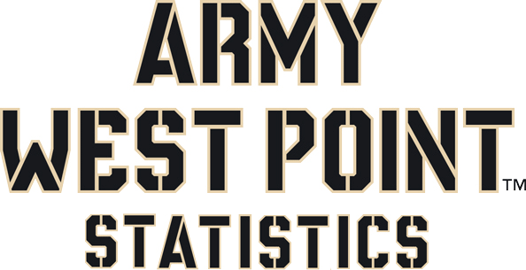

 
```{r setup, include=FALSE}
knitr::opts_chunk$set(echo = TRUE)
```

# Course Admin {#admin} 

Welcome to MA388.  In this course, we will explore model buidling using multiple linear regression, logistic regression, and survival analysis through the world of baseball.

<center></center>

## Course Guide Tips

In the [**Course Admin**](#admin) section, you'll find general information about the course, the overall objectives of the course, and a brief tutorial designed to help you get started using R, the primary technology resource we'll use in MA388.  The course guide is then laid out to match the layout of the course: block by block and lesson by lesson.  

## Course Topics

#### [Block 1: Introduction to Analysis in R](#block1)

#### [Block 2: Multiple Linear Regression](#block2)

#### [Block 3: Logistic Regression](#block3)

#### [Block 4: Survival Analysis](#block4)

## Course Website

The <a href="https://lms.westpoint.edu/math/ma388/SitePages/default.aspx" target="_blank">MA388 Course Webpage</a> provides resources you may find helpful throughout the semester.  

## Instructor Pages  {#instructorpage}

Course Director: **<a href="https://lms.westpoint.edu/math/jason.sharritt/SitePages/Home.aspx" target="_blank">CPT Jay Sharritt</a>** 
<br>
A/Course Director: **<a href="https://lms.westpoint.edu/math/dusty.turner/SitePages/Home.aspx" target="_blank">CPT Dusty Turner</a>**


## Course Textbook

Throughout MA388 we will use the 2nd edition Jared Lander's textbook, **R For Everyone**.  

## Graded Events

MA388 is a 1000-point course.  

|Event|Points|
|-----------|---|
|Block 1 WPR|200|
|Block 2 WPR|200|
|Instructor Points  |100 |
|Course Project (Block 4)|200|
|Term End Exam|300|


## Course Objectives

1.	Understand the notion of randomness and the role of variability and sampling in making inferences.

2.  Develop proficiency with the open source statistical program R in order to create statistical models and comunicate results through visual tools.  

3. Attain, clean, join, and manipulate data in order to prepare it for statistical analysis. 

4.	Construct, apply, assess, and communicate linear, logistic, and cox proportion models to estimate and interpret regression coefficients and draw conclusions from the models. 

5. Understand how variable transformations can assist when modeling assumptions are not met and be able to implement basic transformation of both outcome and explanatory variables. 

6.	Model, solve, and interpret solutions to applied problems that can be examined using principles of probability theory, simulation, or statistical analysis.

7.	Use technology with appropriate software to solve, gain insight, and improve understanding on probability and statistics problems.

8.	 Communicate assumptions, models, and results using technical language in both written and oral formats.

9.  Apply principles of probability and statistics to model and solve problems with baseball applications.

10.	 Develop the skills to critically synthesize statistical data and analysis from all types of media to in order to develop rational, well informed conclusions and opinions about real world issues.  


## Reference Sheets

#### **MA206 Reference Sheets

The **MA206 Reference Sheet** available on the course page is an authorized reference for use during all course-wide assessments. You may access the <a href="https://lms.westpoint.edu/math/ma206/Shared%20Documents/MA206%20Reference%20Sheet.pdf" target="_blank">MA206 REFERENCE SHEET</a> digitally or in hard copy.  A clean hard copy will never count against any notes pages you may otherwise be authorized.

<center></center>

#### **Data Tranformation Reference Sheet**

## Course Calendar 
<a href="https://lms.westpoint.edu/math/ma388/Images1/Calendar%20AY18-02.pdf" target="_blank">PDF Download of Course Calendar</a> 

The course calendar will be updated periodically.  This is current as of `r Sys.Date()`.

<center></center>

***

# Block 1 - Descriptive Statistics and Probability Theory {#block1}

added once finalized
<!-- <center></center> -->

### Block 1 Objectives

1. Develop proficicney in R and become self sufficient when overcoming codeing problems.

2. Attain, clean, join, and manipulate data in order to prepare it for statistical analysis.

3. Create visualizations that provide insite into the data.

4. Develop an appreciation for the history of Sabermetrics.  

***

## Lesson 1 - Course Overview 

1. Objective 1

2. Objective 2

3. [Find your instructor's MA388 page for specific day 1 instructions](#instructorpage)

|Familiarize|Watch|Suggested Problems|
|-------------------|-----------------|-----------|
|Reading | Video | Problems | 

***

## Lesson 2 - Introduction to R and R Studio 

1. Objective 1

2. Objective 2

|Familiarize|Watch|Suggested Problems|
|-------------------|-----------------|-----------|
|Reading | Video | Problems | 


***
## Lesson 3 - Data Collection using RVest

1. Objective 1

2. Objective 2

|Familiarize|Watch|Suggested Problems|
|-------------------|-----------------|-----------|
|Reading | Video | Problems | 


***
## Lesson 4 - Data Cleaning

1. Objective 1

2. Objective 2

|Familiarize|Watch|Suggested Problems|
|-------------------|-----------------|-----------|
|Reading | Video | Problems | 


***
## Lesson 5 - Data Aggregation 

1. Objective 1

2. Objective 2

|Familiarize|Watch|Suggested Problems|
|-------------------|-----------------|-----------|
|Reading | Video | Problems | 


***
## Lesson 6 - Data Mutating 

1. Objective 1

2. Objective 2

|Familiarize|Watch|Suggested Problems|
|-------------------|-----------------|-----------|
|Reading | Video | Problems | 


***

## Lesson 7 - History of Sabermetrics by Father Costa 

1. Objective 1

2. Objective 2

|Familiarize|Watch|Suggested Problems|
|-------------------|-----------------|-----------|
|Reading | Video | Problems | 

***

# Block 2 - Multiple Linear Regression {#block2}

must add this later
<!-- <center></center> -->

### Block 2 Objectives

1. Understand problems that linear regression can inform.  

2. Understand the model building process.

3. Know the assumptions necessary to perform linear regression.

4. Take measures to transform data when linear modeling assumptions are violated.  

***

## Lesson 8 - Data Visualization

1. Objective 1

2. Objective 2

|Familiarize|Watch|Suggested Problems|
|-------------------|-----------------|-----------|
|Reading | Video | Problems | 

***

## Lesson 9 - Exploratory Data Analysis

1. Objective 1

2. Objective 2

|Familiarize|Watch|Suggested Problems|
|-------------------|-----------------|-----------|
|Reading | Video | Problems | 

***

## Lesson 10 - Multiple Linear Regression 

1. Objective 1

2. Objective 2

|Familiarize|Watch|Suggested Problems|
|-------------------|-----------------|-----------|
|Reading | Video | Problems | 

***

## Lesson 11 - Interaction Terms 

1. Objective 1

2. Objective 2

|Familiarize|Watch|Suggested Problems|
|-------------------|-----------------|-----------|
|Reading | Video | Problems | 

***

## Lesson 12 - Modeling Assumptions 

1. Objective 1

2. Objective 2

|Familiarize|Watch|Suggested Problems|
|-------------------|-----------------|-----------|
|Reading | Video | Problems | 

***

## Lesson 13 - Non Linear Transformations

1. Objective 1

2. Objective 2

|Familiarize|Watch|Suggested Problems|
|-------------------|-----------------|-----------|
|Reading | Video | Problems | 

***

## Lesson 14 - Variable Selection

1. Objective 1

2. Objective 2

|Familiarize|Watch|Suggested Problems|
|-------------------|-----------------|-----------|
|Reading | Video | Problems | 

***

## Lesson 15 - Cross Validation

1. Objective 1

2. Objective 2

|Familiarize|Watch|Suggested Problems|
|-------------------|-----------------|-----------|
|Reading | Video | Problems | 

***

## Lesson 16 - Model Selection

1. Objective 1

2. Objective 2

|Familiarize|Watch|Suggested Problems|
|-------------------|-----------------|-----------|
|Reading | Video | Problems | 

***

## Lesson 17 - Drop For Project 

1. Objective 1

2. Objective 2

|Familiarize|Watch|Suggested Problems|
|-------------------|-----------------|-----------|
|Reading | Video | Problems | 

***

## Lesson 18 - Problem Solving Lab 1

1. Objective 1

2. Objective 2

|Familiarize|Watch|Suggested Problems|
|-------------------|-----------------|-----------|
|Reading | Video | Problems | 

***

## Lesson 19 - Project Presentations Linear Models

1. Objective 1

2. Objective 2

|Familiarize|Watch|Suggested Problems|
|-------------------|-----------------|-----------|
|Reading | Video | Problems | 

***

***

## Lesson 20 - WPR1 Instructions

### Authorized References:

You are authorized to bring one sheet of notes (8.5$''$ x 11$''$, front and back).  All notes **MUST** be handwritten **BY YOU**.  In addition to your handwritten notes, you may reference a digital copy or unaltered hard copy of the MA388 Reference Sheet during the WPR.  You may use any calculator you want, and you may use Excel, Mathematica, and RStudio provided that you start with a blank workbook, notebook, or script, respectively.

***


# Block 3 - Logistic Regression {#block3}

must add this later
<!-- <center></center> -->

### Block 3 Objectives

1. Understand problems that logistic regression can inform.  

2. Understand the model building process for logistic regression.

3. Know the assumptions necessary to perform logistic regression.

4. Take measures to transform data when logistic regression modeling assumptions are violated.   

***

## Lesson 21 - Intorudciton to Logistic Regression

1. Objective 1

2. Objective 2

|Familiarize|Watch|Suggested Problems|
|-------------------|-----------------|-----------|
|Reading | Video | Problems | 

***

## Lesson 22 - Testing Signficance of Coefficients

1. Objective 1

2. Objective 2

|Familiarize|Watch|Suggested Problems|
|-------------------|-----------------|-----------|
|Reading | Video | Problems | 

***

## Lesson 23 - Interpretation of Fitted Logistic Regresion Models

1. Objective 1

2. Objective 2

|Familiarize|Watch|Suggested Problems|
|-------------------|-----------------|-----------|
|Reading | Video | Problems | 

***

## Lesson 24 - Assessing Fit: ROC Curves and Classification

1. Objective 1

2. Objective 2

|Familiarize|Watch|Suggested Problems|
|-------------------|-----------------|-----------|
|Reading | Video | Problems | 

***

## Lesson 25 - Logistic Regression Diagnostics

1. Objective 1

2. Objective 2

|Familiarize|Watch|Suggested Problems|
|-------------------|-----------------|-----------|
|Reading | Video | Problems | 

***

## Lesson 26 - Model Building With Logistic Regression

1. Objective 1

2. Objective 2

|Familiarize|Watch|Suggested Problems|
|-------------------|-----------------|-----------|
|Reading | Video | Problems | 

***

## Lesson 27 - Problem Solving Lab 2 

1. Objective 1

2. Objective 2

|Familiarize|Watch|Suggested Problems|
|-------------------|-----------------|-----------|
|Reading | Video | Problems | 

***

## Lesson 28 - Project PResentations: Logistic Regression

1. Objective 1

2. Objective 2

|Familiarize|Watch|Suggested Problems|
|-------------------|-----------------|-----------|
|Reading | Video | Problems | 

***

## Lesson 29 - WPR2 Instructions

### Authorized References:

You are authorized to bring one sheet of notes (8.5$''$ x 11$''$, front and back).  All notes **MUST** be handwritten **BY YOU**.  In addition to your handwritten notes, you may reference a digital copy or unaltered hard copy of the MA388 Reference Sheet during the WPR.  You may use any calculator you want, and you may use Excel, Mathematica, and RStudio provided that you start with a blank workbook, notebook, or script, respectively.

***

# Block 4 - Survival Analysis {#block4}

must add this later
<!-- <center></center> -->

### Block 4 Objectives

1. Understand problems that survival analysis can inform.  

2. Understand the model building process for survival analysis

3. Know the assumptions necessary to perform survival analysis

4. Take measures to transform data when survival analysis modeling assumptions are violated.  

***

## Lesson 30 - Introduction to Survival Analysis

1. Objective 1

2. Objective 2

|Familiarize|Watch|Suggested Problems|
|-------------------|-----------------|-----------|
|Reading | Video | Problems | 

***

## Lesson 31 - Exploring Censored Data 

1. Objective 1

2. Objective 2

|Familiarize|Watch|Suggested Problems|
|-------------------|-----------------|-----------|
|Reading | Video | Problems | 

***

## Lesson 32 - Fitting the Proportional Hazards Regression Model

1. Objective 1

2. Objective 2

|Familiarize|Watch|Suggested Problems|
|-------------------|-----------------|-----------|
|Reading | Video | Problems | 

***

## Lesson 33 - Interpretation of Fitted Hazards Regression Models

1. Objective 1

2. Objective 2

|Familiarize|Watch|Suggested Problems|
|-------------------|-----------------|-----------|
|Reading | Video | Problems | 

***

## Lesson 34 - Model Development 

1. Objective 1

2. Objective 2

|Familiarize|Watch|Suggested Problems|
|-------------------|-----------------|-----------|
|Reading | Video | Problems | 

***

## Lesson 35 - Methods of Assessing the Hazards Assumptions 

1. Objective 1

2. Objective 2

|Familiarize|Watch|Suggested Problems|
|-------------------|-----------------|-----------|
|Reading | Video | Problems | 

***

## Lesson 36 - Assessment of Model Adequacy 

1. Objective 1

2. Objective 2

|Familiarize|Watch|Suggested Problems|
|-------------------|-----------------|-----------|
|Reading | Video | Problems | 

***

## Lesson 37 - Problem Solving Lab 3 

1. Objective 1

2. Objective 2

|Familiarize|Watch|Suggested Problems|
|-------------------|-----------------|-----------|
|Reading | Video | Problems | 

***

## Lesson 38 - Project PResentation Part 3 

1. Objective 1

2. Objective 2

|Familiarize|Watch|Suggested Problems|
|-------------------|-----------------|-----------|
|Reading | Video | Problems | 

***

## Lesson 39 - Cooperstown Drop 

1. Objective 1

2. Objective 2

|Familiarize|Watch|Suggested Problems|
|-------------------|-----------------|-----------|
|Reading | Video | Problems | 

***

## Lesson 40 - Course Review: Problem Solving Lab 4 

1. Objective 1

2. Objective 2

|Familiarize|Watch|Suggested Problems|
|-------------------|-----------------|-----------|
|Reading | Video | Problems | 

***

# Supplemental Material

***

## R Tutorial <a name="tutorial"></a>

R is a free software environment for statistical computing and graphics.  R-Studio is a user-friendly interface used to run the R software package.

### Downloading R and R-Studio

Please ensure that you **download R before you download R-Studio**.  

#### Downloading R

In order to download R, visit <a href="http://cran.cnr.berkeley.edu" target="_blank">The Comprehensive R Archive Network (CRAN)</a> and click on `Download R for Windows`.  In the first line at the top of the page, select `install R for the first time`. **RIGHT CLICK** on the top link that should say `Download R 3.4.3 for Windows` (or something similar depending on the current version of R).  Select `Save target as...` and save it to a folder that you can easily find.  After the file has downloaded, execute the `.exe` file to install R.  Note: **You may have to right-click and `Run as administrator`.  You must install R before you install R-Studio.**

#### Downloading R-Studio

In order to download R-Studio, visit the <a href="https://www.rstudio.com/products/rstudio/download2/" target="_blank">R-Studio Downloads</a> page.  Scroll down the page and **RIGHT CLICK** on the `installer file` for `RStudio 1.0.383 - Windows Vista/7/8/10` (or something similar depending on the current version of R Studio).  Select `Save target as...` and save the file to the same folder that you saved the previous R installation file.  After the file downloads, execute the `.exe` file and install R-Studio.  The first time that you attempt to open R-Studio you may have to search for the program through the search function under the Windows button (the Windows symbol in the lower left corner of your screen).  Once you locate R-Studio, right click on the program and select `Pin to taskbar` so that the program is readily available for future use.  

***

### Getting Started with R 

There are numerous R tutorials available on the Internet.  Here are a few tutorials that you might want to explore after the minimal introductory tutorial provided in this course guide.

- <a href="http://cyclismo.org/tutorial/R/" target="_blank">R Tutorial by Kelly Black</a> 

- <a href="http://www.r-tutor.com/r-introduction" target="_blank">R Tutorial by R Tutor</a> 

- <a href="http://tryr.codeschool.com/levels/1/challenges/1" target="_blank">Try R by Code School</a>

These tutorials will expose you to R's capabilities beyond what you'll see in MA206.  In addition to the introductory tutorial here, this course guide will provide some `R Help` at the bottom of many lesson descriptions in order to guide you toward specific R functions that will help you complete the suggested problems.

### Console vs. R Scripts

The default R-Studio interface places a sub-window called the `Console` on the left or lower-left part of the screen.  When you evaluate commands in the `Console`, recently used commands are available in a `History` tab or by using the up arrow to scroll through commands when the cursor is in the `Console`.  Alternatively, you can create an `R Script` by selecting `File - New File - R Script` or pressing `Ctrl+Shift+N`.  In an R script, you can write a line of code and execute it by pressing `Ctrl+Enter`.  You can run the entire script by selecting `Source` or by pressing `Ctrl+Shift+S`.  You should not expect to revisit at a later date anything you calculate in the `Console`.  Preserving your work in an `R Script` will help you organize and document all of your work for the entire course.  You can also easily adapt previous work to a new application when you have your work saved in scripts.  You may wish to name your scripts with dates or lesson numbers to help you keep them organized.

### R as a Calculator

R can do basic calculations like any calculator.  Just enter the expression you want to evaluate in the `Console` and press `Enter`.

```{r}
2+2
``` 

Let's accomplish the same task in a script.  Create a new script, enter the expression you want to evaluate on the first line of your script, and press `Ctrl+Enter`.  You'll see the same result appear in your `Console`.

```{r}
2+2
``` 

### R Documentation

You can look up the description and proper usage of any R function using the `?` command in the `Console`.  The `Help` panel in RStudio will show you the documentation associated with the function you entered.

```
?sum
```

You can also type `help(sum)` to reach the same documentation page.

### Storing Variables and Calculations

R allows you to define and use variables using either the `=` or `<-` assignment operators.

```{r}
x = 2
print(x)
y <- 2
print(y)
``` 

### Vectors and Matrices

Our data often comes in the form of a vector or matrix.  We can define these as follows:

```{r}
my.vector = c(1,2,3,4,5,6)
my.vector
my.matrix = matrix(my.vector,nrow=2,ncol=3)
my.matrix
``` 
Notice that filling a matrix with a vector of values uses those values to fill the columns first.

Indexing vectors and matrices starts with an index of 1 and always proceeds in a [row,column] order.  Let's retrieve the number 3 from both the vector and the matrix we defined.  The number 3 is the third element of the vector, and it occupies the 1st row, 2nd column of the matrix.

```{r}
my.vector[3]
my.matrix[1,2]
``` 

### Functions

R has a wide range of built-in functions ready to accomplish whatever you're trying to do.  To use one, simply type the name of the function (case-sensitive) and pass it whatever arguments you want the function to evaluate.  You can find out what the function is expecting using the R documentation.  Let's find out what the `sum()` function does.

```
?sum
```

The `sum()` function returns the sum of all the values present in its arguments.  Let's evaluate the sum of `my.vector`.

```{r}
my.vector = c(1,2,3,4,5,6)
sum(my.vector)
``` 

You can also write your own functions.  Let's write a function that returns the square root of the input (i.e., the `sqrt()` function).

```{r}
my.sqrt = function(x){
  result = sqrt(x)
  return(result)
}
``` 

Now we can use our function to evaluate the square root of 4.

```{r}
my.sqrt(4)
``` 

### Sequences

We previously created a vector of the values 1-6.  There are other ways to create this and related sequences.

```{r}
1:6 # This syntax means "1 to 6" and is understood to have increments of 1.
seq(1,6) # Create a sequence from "1" to "6" with an understood step size of 1.
seq(2,12,by=2) # Create a sequence from "2" to "12" with a step size of "2."
x=seq(0,2*pi,length.out=100) # Create a sequence of 100 values evenly spaced from 0 to 2*pi.
``` 

### Basic Plotting

We'll generate a basic X-Y plot here, but there are many more Internet resources that show more detailed plot construction.  Try <a href="http://www.statmethods.net/graphs/index.html" target="_blank">Quick-R Graphs</a> to see a wider range of plot capabilities.  For now, let's plot the curve $y=sin(x)$ for $x \in [0,2\pi]$.

```{r}
x=seq(0,2*pi,length.out=100)
y=sin(x)
plot(x,y)
``` 

Plot customization is something of an art, and you can find extensive Internet resources to help you produce the exact plot you want.  Try `?plot` to see the basic arguments to the `plot()` function.  Let's change our previous plot to a line (add the argument `type="l"`) instead of a scatter plot, and let's give it a title (add the argument `main="sin(x)"`).

```{r}
plot(x,y,type='l',main='sin(x)')
``` 

### Comments

When you write a script, you will benefit later from placing relevant comments in your code to explain what a particular line of code was meant to accomplish.  That can be done as follows using the `#` command.  You can manually type `#` anywhere in a line of code to comment what comes after it, or you can press `Ctrl+Shift+C` to comment the current line or an entire block of selected code.

```{r}
# This code solves Problem #X.
miles = c(3,5,7)
days = c("Monday","Wednesday","Friday")
# Before you perform a complex operation, describe what it is and why you did it in comments.  Here I'm going to generate a string that combines text and numbers inside a for loop.
for(i in 1:length(days)){
  print(paste('I ran ',miles[i],' miles on ',days[i],'.',sep=""))
}
``` 

### Setting the Working Directory

One of the first things to do as a new R user is to `Set the Working Directory`.  This will make sure R always knows where to start looking for any data files you wish to reference.  Create a folder on your desktop or someplace convenient to save all of the data you work with using R.  

You can set a default working directory that R will remember for future use.  

- Go to the `Tools` tab in the toolbar at the top.

- Select `Global Options`.

- Select `Browse`.

- **It is highly recommended that you set the default working directory to the folder that you recently created.**

You can also set the working directory any time you open R by performing the following steps:  

- Go to the `Session` tab in the toolbar at the top.

- Select `Set Working Directory`.

- Select `Choose Directory` (you can also use the shortcut keys `CTRL+SHIFT+H` to accomplish this step).  

- Locate the folder where the desired data file is stored.  

### Importing Data Files

Data files come in many formats, but we will typically use `.csv` files that resemble spreadsheets you can open in Microsoft Excel.  You'll need to ensure you have specified the working directory before attempting to import a data set.  To get started go to the course website's page for <a href="https://lms.westpoint.edu/math/ma206/SitePages/R%20.csv%20Files.aspx" target="_blank">data sets</a> and download `GradeData.csv`.  Be sure to store it in the folder you've specified as your working directory.  Use the following command to import `GradeData.csv` into RStudio.

```{r}
grades = read.csv("GradeData.csv",header=TRUE)
``` 
The data object `grades` now contains all of the data contained in the `GradeData.csv` spreadsheet.  

### Working with Data Frames

Look in the RStudio `Environment` panel for an object called `grades`.  The `grades`object is called a data frame and has a right-facing arrow next to it that you can click to get an expanded view of what is included in `grades`.  You can also examine `grades` by examining its column names, first six rows, last six rows, and overall dimensions.

```{r}
# Display the column names of the grades data frame.
names(grades)
``` 

```{r}
# Display the first six rows of the grades data frame.
head(grades)
``` 

```{r}
# Display the last six rows of the grades data frame.
tail(grades)
``` 

```{r}
# Display the dimensions of the grades data frame.  The Environment panel said grades consisted of 59 observations of 5 variables.
dim(grades)
``` 

### Indexing into a Data Frame

Now that we have saved the data into a data frame called `grades`, we may wish to index into the data frame to extract a specific portion of the data for analysis.  Just like indexing with matrices, indexing into a data frame is done by using square brackets at the end of an object.  First, let's index into the tenth row and second column:  

```{r}
grades[10,2]
``` 

What if we only wanted to look at WPR 1 scores for all students? This is the first column of the data frame, which is indexed as follows:  

```{r}
grades[ ,1] 
``` 

The blank space before the comma denotes that we want ALL the rows while the "1" denotes that we want the first column.  If we wanted only the first row we would type the following:

```{r}
grades[1,]
``` 

There are several ways to yield a single column from a data frame.  In addition to using `grades[,1]` to produce `WPR1` scores, we can also use the `$` operator.

```{r}
grades$WPR1
``` 

We can drop the leading `grades$` from this command by using the `attach()` command with our data frame.

```{r}
attach(grades)
WPR1
``` 

Now `WPR1` can be accessed directly without going through `grades`.  The `attach()` function brings the contents of `grades` to a higher level of visibility.

We may also want to assign the data that we work with into new objects.  For example, if we only wanted to work with WPR1 data, we could assign the WPR1 data into a new object.  Let's assign new objects for each column as follows: 

```{r}
wpr1 = grades[,1]
wpr2 = grades[,2]
instructor = grades[,3]
apsc = grades[,4]
sat = grades[,5] 
``` 

We can combine objects in a data frame by using rbind() and cbind(). The function rbind() combines rows while cbind() combines columns.  Let's combine only the WPR data together using three separate techniques:

#### 1. Use the cbind() function: 

```{r}
wprs = cbind(wpr1,wpr2)
head(wprs)
```  

#### 2. Use the colon operator on the columns: 

```{r}
wprs = grades[,1:2] # The colon takes columns 1 "through" 2.
head(wprs) # We get the same result as Technique 1.
``` 

#### 3. Remove columns 3 through 5 using the "negative sign:"

```{r}
wprs = grades[,-3:-5] # Think of the negative sign as "All Except -3, -4, and -5."
head(wprs) # We get the same result as Techniques 1 and 2.
``` 

Sometimes our data may contain outliers, and we want to perform analysis with and without the outliers.  Let's assume that the second observation (2nd row) is an outlier and we want to remove this observation.  This is easily done as follows:

```{r}
wprs.minus.outlier = wprs[-2,] # Take out 2nd row.
head(wprs.minus.outlier) # Notice the second row is gone.
``` 

### Create a Data Frame

There are many instances when you want to create your own data frame if you are working on a small data set (such as a question in WebAssign).  First let's create two vectors of data, and then we'll combine the vectors into a data frame.  The first vector will be the integers 1 to 10:

```{r}
x = seq(from=1, to=10, by=1)
``` 

Let's create a second vector that is the reverse sequence of numbers from 10 to 1.

```{r}
y = seq(from=10, to=1, by=-1)
``` 

Now, we can combine both vectors into a data frame: 

```{r}
my.data.frame = data.frame("X"=x, "Y" = y)
class(my.data.frame) # The class of the object is a data frame as desired.
head(my.data.frame) #We have two columns of data with the proper column names.
``` 

If we want to change the names of the columns in the data frame we can using the colnames() function and assign the new column names as follows: 

```{r}
colnames(my.data.frame) = c("Column 1", "Column 2")
head(my.data.frame) # Column names have changed.
``` 

### Exploratory Analysis
Let's go back to the original `grades` object that we created earlier.  Maybe we want to explore the relationship between WPR1 grades and the instructor grades.  We may have some intuition and believe that if the student has been doing their homework and maintains a high instructor average, then they should have a high WPR1 score.  In other words, we think that there is a positive relationship between WPR1 scores and instructor grades.

#### Create a scatter plot.

The first step in this exploratory analysis is to create a scatter plot of the two variables:

```{r}
plot(grades[,3], grades[,1], xlab = "Instructor Grades", ylab = 
       "WPR1 Scores", main = "A Scatter Plot of WPR1 Scores against Instructor Grades")
``` 

From the plot above, there appears to be a positive relationship between WPR1 scores and the instructor grade.

#### Calculating summary statistics.

We can look at a few quantitative measures by using the `summary()` function.  Let's take the summary measures from the 1st and 3rd column since those columns correspond to the WPR1 and instructor grade data: 

```{r}
summary(grades[,c(1,3)])
``` 

If we want to compute the variance, standard deviation, or range on columns in a data frame, we can use the apply() function as follows: 

```{r}
apply(grades[,c(1,3)], 2, sd)
``` 

This `applies` the standard deviation function (`sd`) to columns 1 and 3 (columns are denoted with a `2` and rows with a `1` in the second argument of the function). Type `?apply` in the console for more information.  In the following lines of code, we will compute the range, variance, and mean, respectively: 

```{r}
apply(grades[,c(1,3)],2, range) # Compute the ranges of the 1st and 3rd column.
apply(grades[,c(1,3)],2, var) # Compute the variances of the 1st and 3rd column.
apply(grades[,c(1,3)],2, mean) # Compute the means - compare to summary() output.
``` 

You can also compute each one of these values directly by using the `mean()` or `sd()` function for the mean and standard deviation: 

```{r}
mean(grades[,1]) # Compute mean of column 1.
sd(grades[,1]) # Compute the standard deviation of column 1.
``` 

***
