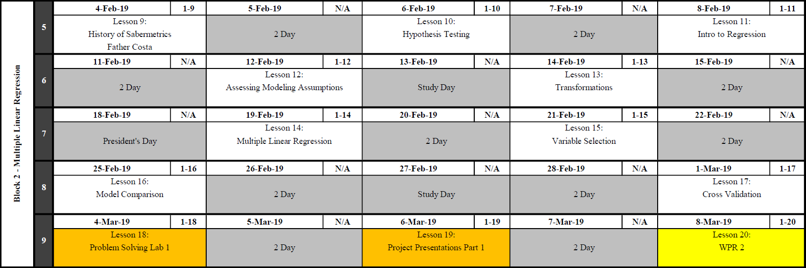
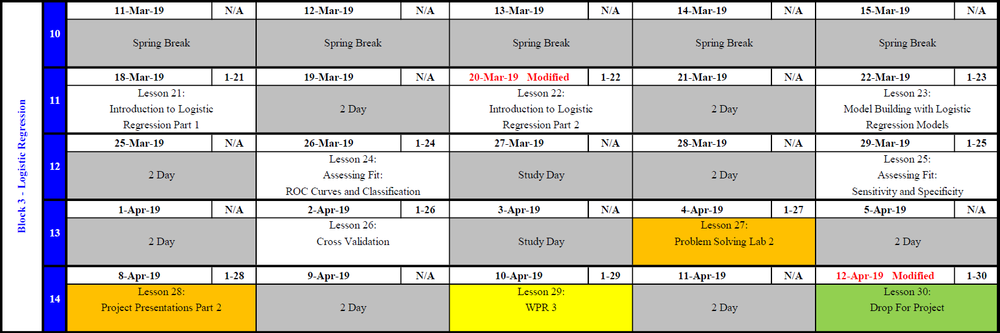
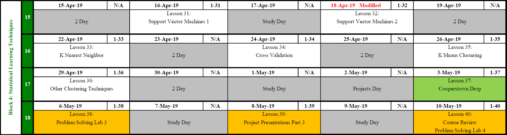

 
```{r setup, include=FALSE}
knitr::opts_chunk$set(echo = TRUE)
```

# Course Admin {#admin} 

Welcome to MA388.  In this course, we will explore model buidling using multiple linear regression, logistic regression, and other statistical learning techniques through the world of baseball.

<center></center>

## Course Guide Tips

In the [**Course Admin**](#admin) section, you'll find general information about the course, the overall objectives of the course, and a brief tutorial designed to help you get started using R, the primary technology resource we'll use in MA388.  The course guide is then laid out to match the layout of the course: block by block and lesson by lesson.  

## Course Topics

#### [Block 1: Introduction to Analysis in R](#block1)

#### [Block 2: Multiple Linear Regression](#block2)

#### [Block 3: Logistic Regression](#block3)

#### [Block 4: Statistical Learning Techniques](#block4)

## Course Website

The <a href="https://lms.westpoint.edu/math/ma388/SitePages/default.aspx" target="_blank">MA388 Course Webpage</a> provides resources you may find helpful throughout the semester.  

## Instructor Pages  {#instructorpage}

Course Director: **<a href="https://lms.westpoint.edu/math/scott.warnke/SitePages/Home.aspx" target="_blank">MAJ Scott Warnke</a>** 
<br>
A/Course Director: **<a href="https://lms.westpoint.edu/math/dusty.turner/SitePages/Home.aspx" target="_blank">MAJ Dusty Turner</a>**

## Course Textbooks

Since MA206 is a prerequisite, we will use the 9th edition of Jay Devore’s textbook, **Probability and Statistics for Engineering and the Sciences**.  In addition to that we will use the 2nd edition of Jared Lander’s textbook, **R for Everyone**.  We will also reference **An Introduction to Statistical Learning with Applications in R (ISLR)** by James et al.  Finally we have access to the 2nd edition of the sabermetrics textbook, **Understanding Sabermetrics**¸ written by our own Father Costa and two of his colleagues.  This text will be published on the course website, https://lms.westpoint.edu/math/ma388/SitePages/default.aspx

## Course Memo

needs updating

<!-- <a href="https://lms.westpoint.edu/math/ma388/SiteAssets/CD%20Memo%20AY18-02.pdf" target="_blank">MA388 Course Director Memo</a> -->

## Graded Events

MA388 is a 1000-point course.  

|Event|Points|
|-----------|---|
|Block 1 WPR|100|
|Block 2 WPR|200|
|Block 3 WPR|200|
|Instructor Points  |100 |
|Course Project (Block 4)|100|
|Term End Exam|300|

## Student Lead Seminars

Your instructor will assign you a date to present a chapter of Father Costa's Book **Understanding Sabermetrics**.  This will be worth a portion of your instructor points.  

## Course Objectives

1. Use the concepts of statistics and probability learned in MA206.

2. Develop proficiency with the open source statistical program R in order to create statistical models and communicate results through visual tools.  

3. Attain, clean, join, and manipulate data in order to prepare it for statistical analysis. 

4. Use advanced modeling and statistical concepts to analyze baseball and other data. 

5. Appreciate the relevance of baseball in utilizing statistical methods by investigating application problems and presenting results.

6. Communicate assumptions, models, and results using technical language in both written and oral formats.

7. Develop the skills to critically synthesize statistical data and analysis from all types of media to in order to develop rational, well informed conclusions and opinions about real world issues.  


## Reference Sheets

The following reference sheets are available on the MA388 Course Guide.  All are authorized references for use during all course-wide assessments unless specifically noted.  You may access them digitally or in hard copy.  A clean hard copy will never count against any notes pages you may otherwise be authorized.

<!-- <a href="https://lms.westpoint.edu/math/ma206/Shared%20Documents/MA206%20Reference%20Sheet.pdf" target="_blank">MA206 REFERENCE SHEET</a>  -->
<!-- <a href="https://lms.westpoint.edu/math/ma206/Shared%20Documents/MA206%20Reference%20Sheet.pdf" target="_blank">Data Tranformation Reference Sheet</a>  -->
<!-- <a href="https://lms.westpoint.edu/math/ma206/Shared%20Documents/MA206%20Reference%20Sheet.pdf" target="_blank">Data Visualization Reference Sheet</a>  -->


#### **<a href="https://lms.westpoint.edu/math/ma388/Images1/MA206%20Reference%20Sheet.pdf" target="_blank"> MA206 Reference Sheet</a> **

<center></center>
<center></center>

#### **<a href="https://lms.westpoint.edu/math/ma388/Images1/Data%20Transformation.pdf" target="_blank"> Data Tranformation Reference Sheet</a> **

<center></center>
<center></center>

#### **<a href="https://lms.westpoint.edu/math/ma388/Images1/data-visualization-2.1.pdf" target="_blank"> Data Visualization Reference Sheet</a> **

<center></center>
<center></center>


## Course Calendar
<a href="https://lms.westpoint.edu/math/ma388/Images1/MA256%20Calendar%20AY18-02.pdf" target="_blank">PDF Download of Course Calendar</a>

The course calendar will be updated periodically.  This is current as of `r Sys.Date()`.

<center></center>

***

# Block 1 - Introduction to Analysis in R {#block1}

<center></center>

### Block 1 Objectives

1. Develop proficiency in R and become self sufficient when overcoming coding problems.

2. Attain, clean, join, and manipulate data in order to prepare it for statistical analysis.

3. Create visualizations that provide insight into the data.

4. Develop an appreciation for the history of Sabermetrics.  

***

## Lesson 1 - Course Overview and Introduction to the Tidyverse

1. Review the Academic Integrity Brief

2. [Find your instructor's MA388 page for specific day 1 instructions](#instructorpage)

3. Install R, R Studio, and Download R Packages from the Comprehensive R Archive Network (CRAN)

4. Read data into R from a CSV file.

5. Understand Data Structures and basic R operations. 


|Familiarize|Watch|Suggested Problems|
|-------------------|-----------------|-----------|
|Lander 1-2 |  | Instructor Specific | 
|Lander 3-6.2 |  | Suggested Problems Below | 

### Suggested Problems:

1. Install `tidyverse`.

2. Read in the `batting256.csv` file from the course sharepoint page.

3. Summaries the data.  What data seems relevant for analysis. Irrelevant? How would you know?

4. Create several plots that you might find interesting.

5. Which player has played the most games? Registered the least hits?  What else do you find interesting?

### R Help

Helpful commands

```{r echo=TRUE, message=FALSE, warning=FALSE}
# install.packages("tidyverse")  Execute this line without the '#' to install the tidyverse
# library(tidyverse) execute this line everytime you restart R to access this package
# getwd() 
# setwd(C:/Users/first.last/Desktop/.../)  Notice that the '\' are backwards '/'.  
# batting = read_csv("batting256.csv") be sure this file is in the working directory
# summary(data)  
# plot(data$y1~data$x1)
# data[which.max(data$X1),]
```

***

## Lesson 2 - Data Collection using RVest

1. Install packages and addons to aid data collection.

2. Understand ethical responsibilities of data scraping.

3. Successfully 'scrape' data from the internet using R

|Familiarize|Watch|Suggested Problems|
|-------------------|-----------------|-----------|
|Lander 6.7-6.9 |  | Suggested Problems Below | 
|<a href="https://blog.rstudio.com/2014/11/24/rvest-easy-web-scraping-with-r/" target="_blank">Web Scraping How To</a>|||


### Suggested Problems

1. Install the <a href="http://selectorgadget.com/" target="_blank">Selector Gadget</a> tool.  
  - You must use Chrome
  - Find the part of the page that says "Or drag this link to your bookmark bar."  Drag the link to the book mark bar.
  - Test that it has installed properly by clicking on the bookmark.  You will know its a success when a box appears in the bottom right corner of your browser and your screen begins to highlight where your mouse rests. 
  - Click on the data of interest on the website to select the proper CSS tag.  

2. Install the `rvest` package using the `install.packages("rvest")` command.

3. 'Scrape' the batting statistics from the <a href="https://www.baseball-reference.com/teams/TEX/2017.shtml" target="_blank">Texas Ranger's</a> page at Baseball Reference.  

4.  Create plot hits vs batting average.  Create other plots that help you visualize the data.

5. Summaries the data.  Who lead the team in RBIs?  Hits?  Strikeouts? Of players who has at least 50 plate appearances, who had the highest batting average?  

6. What issues did you run into during this process?  What was harder: Getting the data or getting the data in a usable format to analyse the data?

### R Help

Install / Load `rvest`
```{r echo=TRUE, message=FALSE, warning=FALSE}
# install.packages("rvest")  
library(rvest)
```

Scrape Data
```{r echo=TRUE, message=FALSE, warning=FALSE}
# Store the URL as a variable
url <- read_html("https://www.baseball-reference.com/teams/TEX/2017.shtml")

#Scrape the website for information.  Use the CSS Selector tool to attain the proper CSS header.
rangers <- url %>% 
  html_nodes("#team_batting .center , #team_batting .left, #team_batting .right") %>%
  html_text()

texas = matrix(rangers, ncol = 28, byrow = TRUE)
texas = as.data.frame(texas)
texas = unique(texas)
colnames(texas) = as.character(unlist(texas[1,]))
texas = texas[-1,]
```

You can now use this information to answer the suggested problems.  

***

## Lesson 3 - Data Cleaning

1. Join multiple data tables.

2. Subset data by...
  - random selection.
  - criteria of columns.
  - row position.
  - variable extraction.
  
3. Save data to a csv file. 
  
|Familiarize|Watch|Suggested Problems|
|-------------------|-----------------|-----------|
|Lander 12.1-12.5, 15 |  | Suggested Problems Below | 

### Suggested Problems

1. Read in the `fielding`, `batting`, and `pitching` data from the course share point site.  

2. 'Join' the the tables together using a full join.  Join the tables on columns such that you do not duplicate data.

3. Select all rows which occurred since 1975.

4. Rename Column headers so that they are easier to understand.

5. Filter the data by playerID, yearID, AB, GamesBatting, GamesField, SBBatting, CSBatting, and HBatting.

6. What is the average hits per season per player since 1975?

<center>{ width=50% }</center>

### R Help 1

**The "PIPE" Tool**:  Using the `tidyverse` gives us the useful tool `%>%` - called the pipe.  A pipe allows us to 'pipe' arguments into functions is a very fluid way -- one that can simplify our coding.  Look at the function below:

```{r echo=TRUE}
myfunction = function(x,y){
  z=x*y
  return(z)
}
```

To use this function, you place arguments in it like you have previously in MA206.  For example:

```{r echo=TRUE}
myfunction(3,4)
```

The `%>%` allows us to pipe in the first argument into our function.  See below:

```{r echo=TRUE}
3 %>% myfunction(4)
```

You can also string many functions together with the pipe.

```{r echo=TRUE}
3 %>% myfunction(4) %>% myfunction(10)
```

The above vignette is a simple application.  You will see next, an throughout the course, the many benefits of 'piping' in R.  

### R Help 2

Use `names(data)` to get a list of the names of your data.

```{r echo=TRUE, message=FALSE, warning=FALSE}
library(tidyverse)
fielding = read_csv("Fielding.csv")
batting = read_csv("Batting.csv")
pitching = read_csv("Pitching.csv")

fieldandbat = 
  fielding %>%
  full_join(batting, by = c("playerID", "yearID", "stint", "teamID", "lgID"))

fieldbatandpitch = 
  fieldandbat %>%
  full_join(pitching, by = c("playerID", "yearID", "stint","teamID", "lgID"))

fieldbatandpitch =
  fieldbatandpitch %>%
  filter(yearID >= 1975)

players = 
  fieldbatandpitch %>% 
  rename(GamesBatting = G.x, GamesField = G.y, GamesStartedField = GS.x, GamesStartedPitching = GS.y, WPFielding = WP.x, 
         SBBatting = SB.x, SBFielding = SB.y, CSBatting = CS.x, CSFielding = CS.y, RBatting = R.x,
         RPitching = R.y, HBatting = H.x, HPitching = H.y, HRBatting = HR.x, HRPitching = HR.y, 
         BBBatting = BB.x, BBPitching = BB.y, SOBatting = SO.x, SOPitching = SO.y, IBBBatting = IBB.x,
         IBBPitching = IBB.y, HBPBatting = HBP.x, HBPPitching = HBP.y, SHBatting = SH.x, SHPitching = SH.y,
         SFBatting = SF.x, SFPitching = SF.y, GIDPBatting = GIDP.x, GIDPPitching = GIDP.y, GPitching = G) 

playersselected = 
  players %>%
  select(playerID, yearID, AB, GamesBatting, GamesField, SBBatting, CSBatting, HBatting)

# mean(playersselected$AB)

write.csv(playersselected, "players.csv")
```


***

## Lesson 4 - Data Aggregation 

1. Know when data aggregation is necessary to support analysis.     

2. Arrange data by specific column names.

3. Group columns on particular traits in preparation for aggregation. 

4. Apply the following (non exhaustive list of) aggregation techniques across grouped variables:
  - sum() / count()
  - mean() / median() / sd() / var()
  - min() / max() / quantile()
  - others from Data Transformation Cheat Sheet

|Familiarize|Watch|Suggested Problems|
|-------------------|-----------------|-----------|
|Lander 12.7-12.9 |  | Suggested Problems Below | 

### Suggested Problems

1. Read in data from last lesson: `players.csv`

2. What is the average at bats per season?

3. Group by year.  What is the average at bats per year?

4. Group by player and year.  Which player had the most at bats in a year?  Which year was it?

5. Group by year.  Arrange the data from most to least by stolen bases.  Who stole the most bases?  How many times was that player caught stealing?  

### R Help

```{r echo=TRUE, message=FALSE, warning=FALSE, results='hide'}
library(tidyverse)

# 1. Read in data from last lesson: `players.csv`
players = read_csv("players.csv")

# 2. What is the average at bats per season?
players %>%
  summarise(mean(AB))

# 3. Group by year.  What is the average at bats per year?
players %>%
  group_by(yearID) %>%
  summarise(mean(AB))

# 4. Group by player and year.  Which player had the most at bats in a year?  Which year was it?
players %>% 
  group_by(yearID, playerID) %>%
  arrange(desc(AB))

# 5. Group by year.  Who stole the most bases?  How many times was that player caught stealing?  
players %>%
  group_by(yearID) %>%
  arrange(desc(SBBatting))
```


***
## Lesson 5 - Data Mutating 

|Familiarize|Watch|Suggested Problems|
|-------------------|-----------------|-----------|
|Lander 12.6 | | Suggested Problems Below | 

1. Know when data mutation is necessary to support analysis.     

2. Apply the following (non exhaustive list of) mutation techniques across variables:
  - sum() / count() 
  - multiply or divide columns
  - ifelse statements to create binary columns 
  
### Suggested Problems

1. Read in data from last lesson: `players.csv`

2. Filter out players who did not attempt a stolen base in a year.  

3. Create a column that tracks attempted steals.  

4. Grouping by year and player. With a minimum of 10 steals in a season, what 5 players have the highest success rate?
 
### R Help 
  
```{r echo=TRUE, message=FALSE, warning=FALSE, results='hide'}
library(tidyverse)

# 1. Read in data from last lesson: `players.csv`
players = read_csv("players.csv")

# 2. Filter out players who did not attempt a stolen base in a year.  

players2 = players %>%
  filter(!is.na(SBBatting)&!is.na(CSBatting))

# 3. Create a column that tracks attempted steals.  

players3 = players2 %>%
  mutate(totalsteals = SBBatting + CSBatting)

# 4. Grouping by year and player. With a minimum of 10 steals in a season, what 5 players have the highest success rate?

players3 %>%
  group_by(yearID, playerID) %>%
  mutate(successrate = SBBatting/totalsteals) %>%
  filter(totalsteals>=25) %>%
  arrange(desc(successrate)) %>%
  ungroup() %>%
  top_n(5,successrate)
  
```


***

## Lesson 6 - Data Visualization

1. Become proficient plotting with ggplot2 in R.

2. Plot data to discover relationships between columns of data.

3. Use graphics to 'tell the story' of the data.

|Familiarize|Watch|Suggested Problems|
|-------------------|-----------------|-----------|
|Lander 7 |  | Suggested Problems Below | 

### Suggested Problems

1. Using `players.csv`, plot a histogram of every athlete's career hits.

2. Is there a relationship between games played and hits?

3. How about career games played, hits, and steals?

4. Create the plot above, but facet by year since 2008.

5. Create labels and titles that make the plot appealing.

6. Using your creativity, create several other plots that tell the story of the data.

### R Help

```{r echo=TRUE, message=FALSE, warning=FALSE, results='hide'}
library(tidyverse)

# 1. Using `players.csv`, plot a histogram of every athlete's career hits.
players = read_csv("players.csv")

plotter = players %>%
  group_by(playerID) %>%
  summarise(careerhits = sum(HBatting))

ggplot(data = plotter, aes(x=careerhits)) +
  geom_histogram()

# 2. Is there a relationship between games played and hits?

plotter = players %>%
  group_by(playerID) %>%
  summarise(careerhits = sum(HBatting), careeratbats = sum(AB))
  
ggplot(data = plotter, aes(x=careeratbats, y=careerhits)) +
  geom_point()

# 3. How about career games played, hits, and steals?

plotter = players %>%
  group_by(playerID) %>%
  summarise(careerhits = sum(HBatting), careeratbats = sum(AB), careersteals = sum(SBBatting))
  
ggplot(data = plotter, aes(x = careeratbats, y = careerhits, color = careersteals)) +
  geom_point()

# 4. Create the plot above, but facet by year since 2008.

plotter = players %>%
  filter(yearID>2007)
  
ggplot(data = plotter, aes(x = AB, y = HBatting, color = SBBatting)) +
  geom_point() +
  facet_wrap("yearID")

# 5. Create labels and titles that make the plot appealing.

ggplot(data = plotter, aes(x = AB, y = HBatting, color = SBBatting)) +
  geom_point() +
  facet_wrap("yearID") +
  labs(title = "Number of Hits vs At Bats by Year since 2008", y = "Hits",
       x = "At Bats", color = "Stolen Bases")


```

## Lesson 7 - Data Presentation with R Markdown

1. Understand the syntax of R Markdown

2. Coherently organize data for a stakeholder using R Markdown.

|Familiarize|Watch|Suggested Problems|
|-------------------|-----------------|-----------|
| | [R Markdown Tutorial](https://rmarkdown.rstudio.com/lesson-1.html)  | Suggested Problems Below | 

1. After going through the tutorial, come to class with an HTML R Markdown presentation with a summary of statistics and two ggplots of the data.

***

# Block 2 - Multiple Linear Regression {#block2}

<center></center>


***

### Block 2 Objectives

1. Understand problems that linear regression can inform.  

2. Understand the model building process.

3. Know the assumptions necessary to perform linear regression.

4. Take measures to transform data when linear modeling assumptions are violated.  

***

## Lesson 9 - History of Sabermetrics by Father Costa 

1. Understand the history of Sabermetrics.  

|Familiarize|Watch|Suggested Problems|
|-------------------|-----------------|-----------|
| |  |  | 

***


## Lesson 10 - Hypothesis Testing

1. Explain the purpose of conducting a hypothesis test.

2. Explain the two types of error associated with hypothesis testing and the relationship between the two types.

|Familiarize|Watch|Suggested Problems|
|-------------------|-----------------|-----------|
|Devore 8.1, | **<a href="https://www.youtube.com/watch?v=cpL38ZeIecE" target="_blank">Hypothesis Testing</a>** | Suggested Problems Below | 
|Supplemental Material|**<a href="https://www.khanacademy.org/math/probability/statistics-inferential/hypothesis-testing/v/type-1-errors"target="_blank">Type I Error</a>** ||

Supplemental Material: P-Value -- The p-value is the probability of obtaining the observed test statistic (or a more extreme result) when the null hypothesis is actually true. More simply stated, how rare is what I just saw if I assume the null hypothesis to be true?

***
### Suggested Problems

1. What is the definition of a Type I error?  What about a Type II error?

2. How is alpha and beta related to the question above?

3. Relative to the steroids question, what hypotheses could we make?

4. What are the type I and II errors related to the question above?

5. Which is more dangerous, a type I or type II error?

***

## Lesson 11 - Intro to Regression 

1. Describe when a linear model is useful.

2. Given a response variable; develop and assess linear regression models to explain its variation using continuous predictors.

3. Interpret model parameters of the linear regression model.

4. Describe the necessary model assumptions for a valid linear regression model.

|Familiarize|Watch|Suggested Problems|
|-------------------|-----------------|-----------|
|Devore 12.1-12.4 |**<a href="https://www.youtube.com/watch?v=66z_MRwtFJM" target="_blank">SLR in R</a>**| Suggested Problems Below | 
||**<a href="https://www.khanacademy.org/math/probability/regression" target="_blank">Khan Academy Video - Regression</a>**

***
### Suggested Problems

1. Using `players.csv`, investigate the relationship between a player's 2Bs and steals.

2. Is there a relationship between years and steals?

3. How much variation is explained by the either of those models?

4. Are there better single predictors for steals?

***

## Lesson 12 - Assessing Modeling Assumptions 

1. Identify and assess the linear modeling assumptions.

2. Visually inspect residual plots to verify linear modeling assumptions.

3. Analytically validate modeling assumptions.  

|Familiarize|Watch|Suggested Problems|
|-------------------|-----------------|-----------|
|Devore 13.1  |**<a href="http://www.r-tutor.com/elementary-statistics/simple-linear-regression/normal-probability-plot-residuals" target="_blank">R-Tutor: Normal Probability Plots</a>**| Suggested Problems Below | 

Using your model above, critique the assumptions of Linearity, Normality, Constant Variance, and Independence.

The following commands may help you create plots to help critique the assumptions.

```{r echo=FALSE, message=FALSE, warning=FALSE, paged.print=FALSE}
# install.packages("car")
library(car)
# residualPlots(modelname)
# qqPlot(modelname)
```

***

## Lesson 13 - Predictor Transformations 

1. Explain the reasoning behind the need to transform data when creating regression models. 

2. Compute multiple data transformations on Simple Linear Regression models.

3. Explain the “Bulging Rule” as a method for identifying possible appropriate transformations.

|Familiarize|Watch|Suggested Problems|
|-------------------|-----------------|-----------|
|Devore 13.2-13.3 |**<a href="https://www.youtube.com/watch?v=HIcqQhn3vSM" target="_blank">Transformations</a>** | Problems | 

Using the `players.csv` data, create the following model. 

```{r}
library(tidyverse)
library(car)
players = read.csv("players.csv") %>%
  filter(AB>0)
mod = lm(HBatting~AB, data = players)
residualPlots(mod, type = "rstandard")
qqPlot(mod)
```
Use the techniques in the reading to attempt to transform the data in order to satisfy your assumptions.  

***

## Lesson 14 - Multiple Linear Regression

1. Given a response variable, develop multiple linear regression models to explain its variation using continuous and categorical predictors.

2. Use R to perform multiple regression using quantitative and categorical predictors.

|Familiarize|Watch|Suggested Problems|
|-------------------|-----------------|-----------|
|Devore 13.4 | **<a href="https://www.youtube.com/watch?v=q1RD5ECsSB0 " target="_blank">MLR in R</a>** | Suggested Problems Below | 

### Suggested Problems

1. Use the players.csv data to create a multiple linear regression.  Select a `y` column that makes sense to you.  

2. Validate your assumptions.

3. Make necessary transformations to satisfy your assumptions.  

***

## Lesson 15 - Variable Selection

1. Understand the statistical meaning of a 'p value,' its limitations, and techniques to overcome these limitations.  

2. Understand the difference in statistical significance and practical significance.

|Familiarize|Watch|Suggested Problems|
|-------------------|-----------------|-----------|
| |**<a href="http://www.r-tutor.com/elementary-statistics/multiple-linear-regression/multiple-coefficient-determination " target="_blank">R-Tutor: R Squared</a>** | Suggested Problem Below | 

The following is the purposeful selection method for linear regression.  Use this for all model building techniques in class for linear regression.  This is a variation of the purposeful selection method provided by Hosmer/Lemeshow/Sturdivant.

1. Fit all univariate models.  IE, each predictor vs with the response variable.  Select candidate predictors whose P Values are below .25.

2. Check for multicolinearity between all candidate predictors.  Remove one of the variables that are highly colinear.

3. For all models whose P values fall below a preset alpha, and that are not highly colinear, move those to a multivariate model.

4. Remove one variable at a time whose P Value is largest and is above a predetermined alpha.  
  a. After removing each variable, determine if any beta hats changed signs or if the magnitude of the beta hats changed greatly.  
  b. If one of the above situation happens, check for multicolinearity between remaining variables.  Move to step 2. 
  
5. Once you have removed all multicolinear variables and all P values are below the predetermined alpha, place removed variables back into the model one at a time to determine if they happen to be significant at this point.

6. This is your final model.  

### Suggested Problem

Using the `player.csv` data, create a "best model" using purposeful selection.

***

## Lesson 16 - Model Comparison

1. Define the following statistics and understand how they are calculated. 
  - AIC
  - BIC
  - R^2
  - Adj R^2
  
2. Know the strengths/limitations in each criterion.

|Familiarize|Watch|Suggested Problems|
|-------------------|-----------------|-----------|
| |**<a href="http://www.r-tutor.com/elementary-statistics/multiple-linear-regression/multiple-coefficient-determination " target="_blank">R-Tutor: R Squared</a>** | Suggested Problems Below | 

### Suggested Problems

1. Create two models using the `players.csv` data.

2. Compare the two model and select a preferred model after analyzing the criteria.

Use the following code to get the following criteria from a model.

```{r}
players = read.csv("players.csv") %>%
  filter(AB>0)
mod = lm(HBatting~AB, data = players)

summary(mod)$r.squared
summary(mod)$adj.r.squared
AIC(mod)
BIC(mod)
```


***

## Lesson 17 - Cross Validation

1. Understand the mechanics behind cross validation.

2. Know the purpose of cross validation and the circumstances to use it.

3. Be able to execute cross validation to understand your model's expected out of sample error.

|Familiarize|Watch|Suggested Problems|
|-------------------|-----------------|-----------|
|ISLR 5.1 |**<a href=" " target="_blank">SLR in R</a>** | Execute the Tutorial Below | 


Lets do an example cross-validation on this model.

```{r message=FALSE, warning=FALSE}
players = read.csv("players.csv") %>%
  filter(AB>0)
mod = lm(HBatting~log(AB), data = players) 

set.seed(388) ## set seed to make this reproducible
nfolds = 10 ## number of folds
cv.error.10 = rep(0,10) #create a vector to store our error
#separate the folds
library(pracma)
fold.assignment = randperm(rep(1:nfolds,length.out=dim(players)[1]),dim(players)[1])
model.data = players %>%
  select(HBatting, AB) %>%
  mutate(fold.assignment = fold.assignment)
SSEFold = NA
for(i in 1:nfolds){
  training.data = model.data[fold.assignment!=i,]#separate out fold i
  test.data = model.data[fold.assignment==i,]#everyone but fold i
  fit = lm(HBatting~log(AB),data=training.data)#fit model to the training data
  predicted.HBatting = predict.lm(fit,test.data) #predict HBatting in the test set
  SSEFold[i] = sum(predicted.HBatting-players$HBatting)^2 # how badly did we miss our estimate squared (SSE)
}
mean(SSEFold) ## average SSE on the data
```

Execute Cross Validation on a model you created.  What is the cross validation error.  

***

## Lesson 18 - Problem Solving Lab 1

|Familiarize|Watch|Suggested Problems|
|-------------------|-----------------|-----------|
| |  | Instructor Specific | 

***

## Lesson 19 - Project Presentations: Linear Models

The presentation schedule will be posted by your instructor.

***

## Lesson 20 - WPR1 Instructions

### Authorized References:

Specific references will be published by the course director before the WPR.

***

# Block 3 - Logistic Regression {#block3}

<center></center>

### Block 3 Objectives

1. Understand problems that logistic regression can inform.  

2. Understand the model building process for logistic regression.

3. Know the assumptions necessary to perform logistic regression.

4. Become a knowledgeable consumer of statistical information.  

***


## Lesson 21 - Introduction to Logistic Regression Part I

1. Recognize types of problems that can be informed by logistic regression and when the method should and should not be applied.

2. Understand assumptions necessary for logistic regression. 

3. Define the logistic regression model.


|Familiarize|Watch|Suggested Problems|
|-------------------|-----------------|-----------|
|Supplemental Reading Below |  | Suggested Problems Below | 

### Supplemental Reading

First create the following dataframe from the `HallofFame.csv`, `Fielding.csv`, and `Batting.csv` files provided on the course website.

```{r message=FALSE, warning=FALSE}
library(tidyverse)
hof = read_csv("HallOfFame.csv") %>%
  filter(inducted == "Y") %>% 
  select(playerID, inducted)

fielding = read_csv("Fielding.csv") %>%
  select(playerID, yearID, POS, G, PO, A, E, DP) %>%
  filter(POS!="P")

batting = read_csv("Batting.csv") %>%
  select(playerID, yearID, G, AB, R, H, `2B`, `3B`, HR, RBI, SB, BB, SO) %>%
  filter(yearID >1911)

joined = fielding %>%
  inner_join(batting, by = c("playerID", "yearID") ,suffix = c(".fielding", ".batting")) 

careerstats = joined %>% group_by(playerID) %>%
  select(-POS, -yearID) %>%
  summarise_all(funs(sum)) %>%
  left_join(hof)

maxyear = joined %>%
  select(playerID, yearID) %>% group_by(playerID) %>%
  arrange(playerID, yearID) %>%
  summarise(lastyear = max(yearID))

primaryposition = joined %>% group_by(playerID, POS) %>% select(playerID, yearID,G.fielding,POS) %>%
  arrange(playerID) %>%
  summarise(gamesatprimarypos = sum(G.fielding)) %>% group_by(playerID) %>%
  arrange(playerID, desc(gamesatprimarypos)) %>%
  slice(1)
  
hofdata = careerstats %>%
left_join(maxyear) %>% 
  left_join(primaryposition) %>%
  mutate(HOF = ifelse(is.na(inducted),0,1)) %>%
  select(-inducted)
```
### Suggested Problems

1. Create a pairwise plot of the `hof` data.

2. Create a linear model to predict if a player makes it into the Hall of Fame.  Use HOF as the 'predicted' variable and 'AB' and 'HR' as the 'predictors.'

3. What are the issues you see with this model?

### Necessary Assumptions for Logistic Regression:

1. The dependent variable should be dichotomous (ie 0/1, Y/N, present/absent).

2. There should be no high correlations (multicollinearity) among the predictors.  You can assess this by looking at the pairs plot or creating a correlation matrix.  

### The Logistic Regression Model.

Do your best to define each term.  Your instructor will go into details in class.

$log(\frac{p}{1-p}) = \beta_0 + \beta_{x1} + \beta_{x2} + ... + \beta_{xn}$

The right hand side of this equation should look familiar.  The right hand side of this equation is called the 'logit' or the log odds.  The `beta` coefficients, instead of being calculated by the least squares method are created via the maximum likelihood.

***

## Lesson 22 - Introduction to Logistic Regression Part II

1. Create a logistic regression model in R.

2. Explain the log-odds, odds, and probability from a logistic regression model.

|Familiarize|Watch|Suggested Problems|
|-------------------|-----------------|-----------|
|Supplemental reading below |  | Suggested Problems Below | 

### Suggested Problems

1. Define each portion of the logistic regression equation below.  Is the right side linear or non linear?  Is the left side linear or non linear? What does one unit change in $x1$ mean?

$log(\frac{p}{1-p}) = \beta_0 + \beta_{x1} + \beta_{x2} + ... + \beta_{xn}$

2. Define each portion of the logistic regression equation below.  Is either side linear?  What does one unit change in $x1$ mean?

$\frac{p}{1-p} = e^{\beta_0 + \beta_{x1} + \beta_{x2} + ... + \beta_{xn}}$

3. Define each portion of the logistic regression equation below.  Is either side linear?  

$p = \frac{e^{\beta_0 + \beta_{x1} + \beta_{x2} + ... + \beta_{xn}}}{1+e^{\beta_0 + \beta_{x1} + \beta_{x2} + ... + \beta_{xn}}$

### Suplimental Reading

Here is how to create a logistic regression model in R.

```{r message=FALSE, warning=FALSE}
options(scipen = 999)
logisticmod = glm(HOF~HR+RBI+lastyear+POS,data = hofdata, family = binomial(link="logit"))
summary(logisticmod)
```

For every one unit change in HRs, the log odds of making the Hall of Fame increases by $.0000640$.

To see how it impact the odds, we can also look at it this way:

```{r message=FALSE, warning=FALSE}
exp(coef(logisticmod))
```

For every one unit change in HR, the odds of making the HOF increases by $e^{\beta_1}$ or $e^{.0000640}$

***

## Lesson 23 - Model Building with Logistic Regresion Models

1. Understand purposeful selection and execute it in building logistic models in R.

|Familiarize|Watch|Suggested Problems|
|-------------------|-----------------|-----------|
|Supplemental reading below |  | Suggested Problems Below | 

### Supplimental Reading

The following is the purposeful selection method for logistic regression.  Use this for all model building techniques in class for logistic regression.  This is a variation of the purposeful selection method provided by Hosmer/Lemeshow/Sturdivant.

1. Fit all univariate models.  IE, Each predictor vs the 1/0 response variable.

2. Check for multicolinearity between all candidate predictors.  Remove one of the variables that are highly colinear.

3. For all models whose P values fall below a certain threshold and that are not highly colinear, move those to a multivariate model.

4. Remove one variable at a time whose P Value is largest and is above a predetermined alpha.  
  a. After removing each variable, determine if any betas changed signs or if the magnitude of the beta changed greatly.  
  b. If one of the above situation happens, check for multicolinearity between remaining variables.  Move to step 2. 
  
5. Once you have removed all multicolinear variables and all P values are below the predetermined alpha, place removed variables back into the model one at a time to determine if they happen to be significant at this point.

6. This is your final model.  


### Suggested Problems

1. Conduct purposeful selection with the HOF data with 6 predictors of your choice.  

***

## Lesson 24 - Assessing Fit: ROC Curves and Classification

1. From a logistic regression model, create a ROC Curve and understand its implications.

2. Produce the "Area Under the Curve" and interpret its meaning.

|Familiarize|Watch|Suggested Problems|
|-------------------|-----------------|-----------|
|Supplemental reading below |  | Suggested Problems Below |

### Supplemental Reading

Lets use the model below to build a Receiver Operator Characteristic curve and analyse the Area Under the Curve 

```{r message=FALSE, warning=FALSE}
logisticmod = glm(HOF~RBI+lastyear+POS,data = hofdata, family = binomial(link="logit"))
summary(logisticmod)
names(hofdata)
```

Using this model, we can "predict" a probability that an individual makes it to the HOF.

```{r message=FALSE, warning=FALSE}
hofpred = predict.glm(logisticmod, newdata = hofdata, type = "response")
head(hofpred)
```

This is the first six probabilities according to our model.  The first person (Hank Aaron), has a 98% chance of making the hall of fame.  The rest... not so much.  

We need to determine a "cut point" such that everyone above the cut point is considered in the hall of fame and everyone below the cut point is below.  We have two tools to do this.

First, we have the ROC curve.  This 'curve' is an overall measure for how good our model does at discriminating between our 1/0s.

We also must download the `ROCR` library.

```{r message=FALSE, warning=FALSE}
library(ROCR)
pred = prediction(hofpred,hofdata$HOF)
roc.perf = performance(pred, measure = "tpr", x.measure = "fpr")
plot(roc.perf)
abline(a=0, b= 1)
```

The goal here is to have a very steep curve.  When the False Positive rate is relatively low, we have a large true positive rate.  

To determine the quality of our discrimination, we'll look at the Area Under the Curve

```{r message=FALSE, warning=FALSE}
auc.perf = performance(pred, measure = "auc")
auc.perf@y.values
```

This shows that the model does a good job distinguishing between who make and who does not make the hall of fame.  This metric can be misleading though, and we'll discuss that in class.

### Suggested Problems

1.  Create the ROC Curve for the final model you created at the end of the previous lesson.

2.  Calculate the AUC for the same model. 

***

## Lesson 25 - Assessing Fit: Sensitivity and Specificity

1. Produce and interpret a models sensitivity and specificity.

2. Determine the optimal cut point for your model according to stated goals.

|Familiarize|Watch|Suggested Problems|
|-------------------|-----------------|-----------|
|Supplemental reading below |  | Suggested Problems Below |

***

### Suggested Reading

We will further explore the best cut point by exploring sensitivity and specificity in a confusion matrix.

Lets create an arbitrary cut point of .5.  In other words, if our model predicts a .5 or greater probability of being in the hall of fame, we'll classify them as being in the hall of fame.  If below .5, we'll consider them not in the HOF.  

```{r message=FALSE, warning=FALSE}
cut = ifelse(hofpred>.5,1,0)
sum(cut)
```

You can see that we only predicted 50 players from history to be in the HOF, so we are under-predicting.  But lets take a deeper look by creating a confusion matrix.  

You will need to install the caret library to do this.


```{r message=FALSE, warning=FALSE}
library(caret)
confusionMatrix(as.factor(cut), as.factor(hofdata$HOF))
```

We can tell from the confusion matrix that we correctly classified at not in the HOF 8040 players and correctly classified in the hall of fame 27 players.  However, we incorrectly predicted 23 players as being in the hall of fame and also incorrectly predicted 135 players as not being in the hall of fame.  

We were 98% accurate, which sounds nice but we also need to consider that if we just said no one was in the hall of fame that we'd get a pretty high percentage correct.  So the accuracy rate shouldn't be taken as the end all statistic.  

Sensitivity is the true positive rate.

Specificity is the true negative rate.

We are pretty good at getting our true positives correct (sensitivity) by correctly identifying who should be in the HOF.

We are pretty bad at the true negative rage (specificity) by poorly identifying who should be classified as not being in the HOF.

Lets find a better cut point by iterating over many possible cut points and identifying which one maximizes accuracy and see how that does. 


```{r message=FALSE, warning=FALSE}
 accuracy = NA
 for (i in 1:100) {
   temp = ifelse(hofpred>i/100,1,0)
   cm = confusionMatrix(as.factor(temp), as.factor(hofdata$HOF))
   accuracy[i] = cm$overall['Accuracy']
   # print(i)
   # print(cm$overall['Accuracy'])
 }
 trackerdf = data.frame(index = 1:100, accuracy = accuracy)
 trackerdf$index[which.max(trackerdf$accuracy)]
```

This shows that the accuracy is maximized when the cut points is a .87.


```{r message=FALSE, warning=FALSE}
 cut = ifelse(hofpred>.87,1,0)
 confusionMatrix(as.factor(cut), as.factor(hofdata$HOF))
```

As you can see, this is not ideal and we will improve off this in class.

### Suggested Problems

1. Using the model you built in previous lessons, find the ideal cut point using these methods.

2. Discuss your models sensitivity and specificity.  Put these in terms of a real world take away.  

***

## Lesson 26 - Cross Validation

1. Understand the mechanics behind cross validation.

2. Know the purpose of cross validation and the circumstances to use it.

3. Be able to execute cross validation to understand your model's expected out of sample error.

|Familiarize|Watch|Suggested Problems|
|-------------------|-----------------|-----------|
|Supplemental reading below |  | Suggested Problems Below |

### Suggested Problems

Run the code line by line on your machine and understand the mechanics of cross validation.

```{r message=FALSE, warning=FALSE}
logisticmod = glm(HOF~RBI+lastyear+POS,data = hofdata, family = binomial(link="logit")) # Build model
hofpred = predict.glm(logisticmod, newdata = hofdata, type = "response") # make predictions from model on meta-data
cut = .8 # select arbitrary cut point
nfolds = 10 # number of folds
cv.error.10 = rep(0,10) #create a vector to store our error
#separate the folds
library(pracma)
set.seed(388)
fold.assignment = randperm(rep(1:nfolds,length.out=dim(hofdata)[1]),dim(hofdata)[1])  ## create fold assignment
model.data = hofdata %>%  # select data needed for cv with fold assignment
  select(HOF,RBI,lastyear,POS) %>%
  mutate(fold.assignment = fold.assignment)
classificationrate = NA
for(i in 1:nfolds){
  training.data = model.data[fold.assignment!=i,] #separate out fold i
  test.data = model.data[fold.assignment==i,] #everyone but fold i
  fit = glm(HOF~RBI+lastyear+POS,data = training.data, family = binomial(link="logit")) # build model
  predictionTRN = predict.glm(logisticmod, newdata = test.data, type = "response") # predict HBatting in the test set
  declare = ifelse(predictionTRN>cut,1,0) # percent liklihood model gives each individal to make the HOF
  correct = ifelse(declare==test.data$HOF,1,0) # what we declare based off our model and the cutrate
  classificationrate[i] = sum(correct)/length(correct)  # classification rate
}
mean(classificationrate) # average SSE on the data


```


***

## Lesson 27 - Problem Solving Lab 2 

1. Specific instructions will be provided by your instructor prior to class.  

|Familiarize|Watch|Suggested Problems|
|-------------------|-----------------|-----------|
| |  |  | 

Your instructor will provide specific guidance for this lesson.

***

## Lesson 28 - Project Presentations: Logistic Regression

The presentation schedule will be posted by your instructor.

***

## Lesson 29 - WPR2 Instructions

### Authorized References:

Specific references will be published by the course director before the WPR.

***

## Lesson 30 - Drop For Project

***

# Block 4 - Statistical Learning Techniques {#block4}

<center></center>

### Block 4 Objectives

1. Understand appropriate applications, necessary assumptions, and limitations for Support Vector Machines.  

2. Understand appropriate applications, necessary assumptions, and limitations for the K Nearest Neighbor algorithm.  

3. Understand appropriate applications, necessary assumptions, and limitations for K Means Clustering.  

***

## Lesson 31 - Support Vector Machines 1

1. Understand appropriate applications for Support Vector Classifiers.

2. Articulate assumptions, limitations, and drawbacks of Support Vector Classifiers.

3. Execute a Support Vector Classifier in R.  

|Familiarize|Watch|Suggested Problems|
|-------------------|-----------------|-----------|
|ISLR 9.1-9.4 | | Suggested Problems Below | 
|[SVM Tutorial](https://dustyturner.shinyapps.io/SupportVectorMachinesShiny/) | | | 

Support Vector Machines, and the more simpler cousin, Support Vector Classifiers attempt to accomplish the same goal of logistic regression: Assign members of a population into two groups.  Because of that, lets revisit our HOF data from logistic regression.

```{r}
hofdataSVM = hofdata %>%
  filter(POS != "P", G.fielding>2000) %>%
  filter(lastyear>=1990) %>%
  filter(lastyear<=2010) %>%
  mutate(HOF = as.factor(HOF)) %>%
  select(G.fielding,RBI,R,H,AB,HOF) 
head(hofdataSVM)

sum(as.numeric(hofdataSVM$HOF)-1)/nrow(hofdataSVM)
```

Lets take a look at two of the variables to determine who is in the HOF

```{r}
hofdataSVM %>%
  ggplot(aes(x=G.fielding,y=RBI, color = HOF)) +
  geom_point()
```

It looks like, generally, the more you field and the more RBIs you hit, the more likely you are to be in the hall of fame.  Lets execute a maximal marginal classifier on this data and take a look.

```{r}
library(e1071)
svmfit = svm(HOF ~ G.fielding+RBI, data = hofdataSVM, kernel = "linear", cost = 10, scale = FALSE)
plot(svmfit, hofdataSVM, RBI~G.fielding)

```

In the above plot, everything in blue has been determined to be a hall of famer.  The 'X's are the support vectors. The red colors are the actual HOFers and the black are the non-HOFers.  So red in the blue is a correct.  Black in the Blue is incorrect.  Red in the pink is incorrect.  Black in the blue is incorrect. 

You'll notice the Cost parameter.  We can adjust this parameter to improve our performance.  We can do this through cross validation.

```{r}
set.seed(1)
tune.out = tune(svm, HOF ~ G.fielding+RBI, data = hofdataSVM, kernel = "linear", ranges = list(cost = c(0.001, 
    0.01, 0.1, 1, 5, 10, 100)))
bestmod = tune.out$best.model
summary(bestmod)
```

The best cost parameter is .001.  Lets take a look at the plot when c=.001

```{r}
plot(bestmod, hofdataSVM, RBI~G.fielding)
```

What happened?  We have classified all players as not making the hall of fame.  This is an issue you may run into when it comes to data with very few true positives in many classification systems.  We'll see if we can improve on it in the next lesson.

***

## Lesson 32 - Support Vector Machines 2

1. Understand appropriate applications for Support Vector Machines.

2. Articulate assumptions, limitations, and drawbacks of Support Vector Machines.

3. Execute a Support Vector Machines in R.  

|Familiarize|Watch|Suggested Problems|
|-------------------|-----------------|-----------|
|ISLR 9.1-9.4 | | Suggested Problems Below | 
|[SVM Tutorial](https://dustyturner.shinyapps.io/SupportVectorMachinesShiny/) | | | 

In the previous lesson, we were trying to classify those who were in the HOF and those who were not and we were bounded by linearity.  In this lesson, we'll remove that constraint.  

There are many different "shapes" (controlled by kernel) and a different "wiggliness" (controlled by gamma) that we can use to try to classify our data.  Here is one example.

```{r}
svmfit = svm(HOF ~ G.fielding+RBI, data = hofdataSVM, kernel = "radial", gamma = 1, cost = 1, scale = FALSE)
plot(svmfit, hofdataSVM, RBI~G.fielding)
```

Does not look so good right now.  Lets cross validate to find the optimum cost and gamma.

```{r}
tune.out <- tune(svm, HOF ~ G.fielding+RBI, data = hofdataSVM, kernel = "radial", ranges = list(cost = c(2, 10, 100, 1000), gamma = c(0.0001, 0.001, .01, 1, 10,100)))
best.model = tune.out$best.model
summary(best.model)
```

Lets take a look at this model:

```{r}
svmfit = svm(HOF ~ G.fielding+RBI, data = hofdataSVM, kernel = "radial", gamma = .0001, cost = 2, scale = FALSE)
plot(svmfit, hofdataSVM, RBI~G.fielding)
```

What could be wrong with this model?

### Suggested Problems

1. Use the app in the [SVM Tutorial](https://dustyturner.shinyapps.io/SupportVectorMachinesShiny/) to see how changes to the cost and gamma parameters change the outcomes.

<!-- This app below allows you to tinker around with the cost and gamma to see the effect each has on the SVM -->

<!-- ```{r, echo=FALSE, cache=FALSE} -->
<!-- library(shiny) -->
<!-- ui <- fluidPage( -->
<!--   numericInput("c", "Choose C:",value = 2,min=.0001,max = 10, step = .1), -->
<!--   numericInput("gamma", "Choose Gamma:",value = 1,min=.00001,max = 10, step = .1), -->
<!--   # textOutput("indexes"), -->
<!--   plotOutput("svmplot"), -->
<!--   plotOutput("kernplot") -->
<!-- ) -->

<!-- server <- function(input, output) { -->

<!--    output$svmplot <- renderPlot({ -->
<!--     set.seed(488) -->
<!--     x = hofdataSVM -->
<!--      svmfit = svm(HOF ~ G.fielding+RBI,data=x,kernel="radial", cost = input$c, gamma = input$gamma,scale = FALSE) -->
<!--      plot(svmfit, hofdataSVM, RBI~G.fielding) -->
<!--    }) -->
<!-- } -->

<!-- shinyApp(ui = ui, server = server, options = list(height=1300)) -->
<!-- ``` -->


### Suggested Problems

1.  Use different variables to classify players in and out of the hall of fame with Support Vector Machines. 

***

## Lesson 33 - K Nearest Neighbor

1. Understand how the K Nearest Neighbor algorithm works.

2. Understand what type of problems can be informed by K Nearest Neighbor.

3. Execute KNN in R. 

|Familiarize|Watch|Suggested Problems|
|-------------------|-----------------|-----------|
| ISLR pg 38-40, 163-164 |  | Suggested Problem Below | 

The idea of the K Nearest Neighbor Algorithm is to determine similarity between observations.  In `n` dimensional space, we determine some form of distance between our observations (euclidean for our purposes, but can be others), then assign out of sample data to the class of its nearest neighbor.  

Here is KNN is action.  We'll continue to use the HOF data.


```{r}
library(class)
hofdataKNN = hofdata %>% filter(complete.cases(.)) %>% select(H,RBI,HOF,lastyear)
train = hofdataKNN %>% filter(lastyear<2000) %>% select(-lastyear)
test = hofdataKNN %>% filter(lastyear>2000) %>% select(-lastyear)
assignment = knn(train, test, train$HOF,k=1)
```

This assignment vector contains all the KNN predictions when we select the player most like that individual.

```{r}
testassign = test %>% mutate(assignment = assignment) %>%
  mutate(Result = ifelse(HOF==assignment & HOF==0,"True Negative",
                         ifelse(HOF==assignment & HOF==1,"True Positive",
                                ifelse(HOF!=assignment & HOF==0,"False Positive","False Negative"))))
head(testassign,30)
```

You can see here the result of our KNN predictions.

Lets plot it.  

```{r}
testassign %>%
  ggplot(aes(x=H,y=RBI, color = Result)) +
  geom_point()
```

Does changing our K impact our results?

```{r}
hofdataKNN = hofdata %>% filter(complete.cases(.)) %>% select(H,RBI,HOF,lastyear)
train = hofdataKNN %>% filter(lastyear<2000) %>% select(-lastyear)
test = hofdataKNN %>% filter(lastyear>2000) %>% select(-lastyear)
assignment = knn(train, test, train$HOF,k=3)
testassign = test %>% mutate(assignment = assignment) %>%
  mutate(Result = ifelse(HOF==assignment & HOF==0,"True Negative",
                         ifelse(HOF==assignment & HOF==1,"True Positive",
                                ifelse(HOF!=assignment & HOF==0,"False Positive","False Negative"))))
testassign %>%
  ggplot(aes(x=H,y=RBI, color = Result)) +
  geom_point()
```

### Suggested Problems

1. We have no true positives on the last example?  Why is that?

2. How could we find an optimal K?

3. Conduct KNN with different variables.  What what is the optimal K?

***

## Lesson 34 - Cross Validation 

1. Understand how to execute cross validation to all types of machine learning techniques.

|Familiarize|Watch|Suggested Problems|
|-------------------|-----------------|-----------|
|  |  | Suggested Problems Below | 

Lets execute cross validation on a new problem.

Lets do something else with our hofdata.  Lets try to predict the new-ish players position given how they compare to old players.  

```{r}
hofdataKNN = hofdata %>% select(POS,H,R,lastyear)

train = hofdataKNN %>% filter(lastyear<2000) %>% select(-lastyear,-POS)
trainlabel = hofdataKNN %>% filter(lastyear<2000) %>% select(POS)
test = hofdataKNN %>% filter(lastyear>2000) %>% select(-lastyear,-POS)
testlabel = hofdataKNN %>% filter(lastyear>2000) %>% select(POS)
assignment = knn(train, test, trainlabel$POS,k=1)
testassign = test %>% mutate(assignment = assignment) %>%
  mutate(POS = testlabel$POS) %>%
  mutate(Result = ifelse(POS==assignment,"Right","Wrong"))
testassign %>%
  ggplot(aes(x=H,y=R, color = Result)) +
  geom_point()

```

Not terrible.  Lets determine a "best" K through cross validation.

```{r}
set.seed(388) ## set seed to make this reproducible
nfolds = 10 ## number of folds
cv.error.10 = rep(0,10) #create a vector to store our error
#separate the folds
library(pracma)
fold.assignment = randperm(rep(1:nfolds,length.out=dim(hofdataKNN)[1]),dim(hofdataKNN)[1])
model.data = hofdataKNN %>%
  mutate(fold.assignment = fold.assignment)
correctclassFold = NA
maxk = 50
correctclassFoldforK = matrix(rep(NA,2*maxk),nrow = maxk) 

for (j in 1:maxk) {
  for (i in 1:nfolds) {
  training.data = model.data[fold.assignment != i, ]#separate out fold i
  training.data.label = training.data$POS
  training.data = training.data %>% select(-POS)
  test.data = model.data[fold.assignment == i, ]#everyone but fold i
  test.data.label = test.data$POS
  test.data = test.data %>% select(-POS)
  assignment = knn(training.data, test.data, training.data.label, k = j)
  correctclassFold[i] = sum(assignment == test.data.label) / length(assignment)
  
  }
  correctclassFoldforK[j, 1] = mean(correctclassFold) ## average SSE on the data
  correctclassFoldforK[j, 2] = j
}
colnames(correctclassFoldforK) = c("correctclassrate", "k")
correctclassFoldforK %>% as.tibble() %>%
  ggplot(aes(x=k,y=correctclassrate)) + geom_point()

```


```{r}
hofdataKNN = hofdata %>% select(POS,H,R,lastyear)

train = hofdataKNN %>% filter(lastyear<2000) %>% select(-lastyear,-POS)
trainlabel = hofdataKNN %>% filter(lastyear<2000) %>% select(POS)
test = hofdataKNN %>% filter(lastyear>2000) %>% select(-lastyear,-POS)
testlabel = hofdataKNN %>% filter(lastyear>2000) %>% select(POS)
assignment = knn(train, test, trainlabel$POS,k=40)
testassign = test %>% mutate(assignment = assignment) %>%
  mutate(POS = testlabel$POS) %>%
  mutate(Result = ifelse(POS==assignment,"Right","Wrong"))
testassign %>%
  ggplot(aes(x=H,y=R, color = Result)) +
  geom_point()

```

```{r}
hofdataKNN = hofdata %>% select(playerID,H,R,lastyear)

train = hofdataKNN %>% filter(lastyear<2000) %>% select(-lastyear,-playerID)
trainlabel = hofdataKNN %>% filter(lastyear<2000) %>% select(playerID)
test = hofdataKNN %>% filter(lastyear>2000) %>% select(-lastyear,-playerID)
testlabel = hofdataKNN %>% filter(lastyear>2000) %>% select(playerID)
assignment = knn(train, test, trainlabel$playerID,k=1)
testassign = hofdataKNN %>% filter(lastyear>2000) %>%
  mutate(assignment = assignment)
```

This wold be more helpful if we knew who they were....


```{r}
library(DT)
master = read.csv("Master.csv") %>% 
  mutate(Name = paste(nameFirst,nameLast)) %>%
  select(playerID,Name) 
testassign %>% left_join(master, "playerID") %>%
  left_join(master, c("assignment"="playerID"), suffix = c("YoungPlayer", "OldPlayer"))  %>% 
  select(-playerID) %>%
  datatable()
```

### Suggested Problems

1. Use other data and do cross validation to predict who should be in the Hall of Fame.

***

## Lesson 35 - K Means Clustering

1. Understand the difference in supervised and unsupervised learning.

2. Use K Means Clustering to assign observations into similar groups.

|Familiarize|Watch|Suggested Problems|
|-------------------|-----------------|-----------|
|ISLR 10.3.1 | | Suggested Problems Below | 

The next two lessons will be focused on unsupervised learning.  With supervised learning, you have a response variable.  In unsupervised learning, you do not.  The idea with unsupervised learning is to let the data give you ideas about similarity within its self.  

K-NN has pros and cons:

Pros:

- You have to make no assumptions about the data (for example: linear, normal, etc)
- The algorithm is relatively simple and easy to interpret
- Relatively high accuracy compared to other methods

Cons:

- The algorithm is slow and will not work on large data sets
- Sensitive to the scale of the data

Again, we use the HOF Data

```{r}
hofdatakmeans = hofdata %>% select(HR,H)
clusters = kmeans(hofdatakmeans,5)
```

The kmeans function has a long print out.  In the interest of space, we recommend you doing this on your own machine to familiarize yourself with the result.  

K means clustering assigns each point to a centroid.  These centroids are found iteratively by randomly selecting k centroids and assigning each point to the closest centroid.  The mean of each cluster is calculated then each centroid is reassigned to that mean.  Points are reassign and this process continues iteratively until there is no change (or little change) between locations of centroids and assignments of points.

Lets plot the above clusters.

```{r}
hofdatakmeans = hofdatakmeans %>%
  mutate(cluster = as.factor(clusters$cluster)) 
hofdatakmeans %>% 
  ggplot(aes(x=H,y=HR, color = cluster)) +
  geom_point()
```

You can see how each point is assigned to a cluster.

How do we know this is the optimal amount of clusters?  Lets look through several K and make that decision based off the within cluster sum of squares.  This is the sum of squared error between each point and its cluster centroid.  Of course, the more clusters we have, the lower the within cluster sum of squares will become until each point is assigned to each own cluster (thus reducing our within cluster sum of squares to 0).  We'll need to find a balancing point.

```{r}
k = 50
kmeansdf = matrix(rep(NA,k*2), ncol = 2)

for (i in 1:k) {
kmeansdf[i,1]=mean(kmeans(hofdatakmeans,i, iter.max = 200, algorithm = "MacQueen")$withinss)
kmeansdf[i,2]=i
}
colnames(kmeansdf) = c("avgwithin","k")
kmeansdf = kmeansdf[-c(1:4),]

kmeansdf %>% as.tibble() %>%
  ggplot(aes(x=k,y=avgwithin)) +
  geom_point()
```

Using the 'elbow method' -- eyeballing where the graph has an elbow, leads me to select k=15 as my appropriate number of clusters.  There are other more sophisticated ways to determine this and we'll discuss that in class.

Lets take a look at the plot when k = 15.

```{r}
hofdatakmeans = hofdata %>% select(HR,H)
clusters = kmeans(hofdatakmeans,15, iter.max = 200, algorithm = "MacQueen")
hofdatakmeans = hofdatakmeans %>%
  mutate(cluster = as.factor(clusters$cluster)) 
hofdatakmeans %>% 
  ggplot(aes(x=H,y=HR, color = cluster)) +
  geom_point()
```

Lets take one more look.  What happens if we use more than 3 dimensions?

```{r}
hofdatakmeans = hofdata %>% select(HR,H,R,SO) %>% filter(complete.cases(.))
clusters = kmeans(hofdatakmeans,15, iter.max = 200, algorithm = "MacQueen")
hofdatakmeans = hofdatakmeans %>%
  mutate(cluster = as.factor(clusters$cluster)) 
hofdatakmeans %>% 
  ggplot(aes(x=H,y=HR, color = cluster)) +
  geom_point()
```

We start to get an overlap.  If you are astute, you may be asking the question, "If our clusters are controlled by a distance metric, does the scale of our data have any impact"?

Absolutely.

Lets center and scale the data and take a look.

```{r}
hofdatakmeans = hofdata %>% select(HR,H) %>% filter(complete.cases(.)) %>%
  mutate(HR = scale(HR), H = scale(H))
clusters = kmeans(hofdatakmeans,15, iter.max = 200, algorithm = "MacQueen")
hofdatakmeans = hofdatakmeans %>%
  mutate(cluster = as.factor(clusters$cluster)) 
hofdatakmeans %>% 
  ggplot(aes(x=H,y=HR, color = cluster)) +
  geom_point()
```

It is very interesting what has happened.  Can you think of why?

### Suggested Problems

1. Using this data, select 4 columns.  

2. Center and scale the data and find the "best" K.  

3. Plot the data using different combinations of your four variables.  

4. What do you learn? 

## Lesson 36 - Other Clustering Techniques 

1. Understand the difference in supervised and unsupervised learning.

2. Use K Means Clustering to assign observations into similar groups.

|Familiarize|Watch|Suggested Problems|
|-------------------|-----------------|-----------|
| ISLR 10.3.2 | | Suggested Problems Below | 

Hierarchical clustering does not require us to pre-specify the number of clusters.  This technique provides a treelike structure where each observation can fall into different clusters depending on how high you want to 'prune' your tree.  You can see this from the output below.

```{r}
hofhier = hofdata %>% select(H,R,HR) %>%
  mutate(H = scale(H),R = scale(R),HR = scale(HR))
x = hclust(dist(hofhier), method = "complete")
x
```

Lets look at the plot of the hierarchical cluster below.

```{r}
plot(x)
```

This shows that each observation could fall into their own cluster (bottom of the tree) or that every observation could be in its own tree.

We can now determine how many clusters we want 'k' or how high we want to prune 'h'.

You can see below how many clusters we will end up with be selecting different values for 'h'.

```{r}
unique(cutree(x,h=1))
unique(cutree(x,h=2))
unique(cutree(x,h=3))
unique(cutree(x,h=4))
unique(cutree(x,h=5))
unique(cutree(x,h=6))
unique(cutree(x,h=7))
```

Lets take a look at a plot of our data if we select 12 clusters.
```{r}
hofdata %>% select(H,R,HR) %>%
  mutate(cluster = as.factor(cutree(x,k=12))) %>%
  ggplot(aes(x=HR,y=H, color = cluster)) +
  geom_point()
```
 
### Suggested Problems

1. Using the same data you selected last lesson, use hierarchical clustering.  

2. Select the same number of clusters that you did last time.  

3. Plot your results.

4. Do your plots look similar?

***

## Lesson 37 - Cooperstown Drop 

***

## Lesson 38 - Problem Solving Lab 3 

1. Specific instructions will be provided by your instructor prior to class.  

|Familiarize|Watch|Suggested Problems|
|-------------------|-----------------|-----------|
| |  |  | 

***

## Lesson 39 - Project Presentation: Statistical Learning Techniques 

The presentation schedule will be posted by your instructor.

***

## Lesson 40 - Course Review: Problem Solving Lab 4 

|Familiarize|Watch|Suggested Problems|
|-------------------|-----------------|-----------|
| |  |  | 

***

# Supplemental Material

***

## R Tutorial <a name="tutorial"></a>

R is a free software environment for statistical computing and graphics.  R-Studio is a user-friendly interface used to run the R software package.

### Downloading R and R-Studio

Please ensure that you **download R before you download R-Studio**.  

#### Downloading R

In order to download R, visit <a href="http://cran.cnr.berkeley.edu" target="_blank">The Comprehensive R Archive Network (CRAN)</a> and click on `Download R for Windows`.  In the first line at the top of the page, select `install R for the first time`. **RIGHT CLICK** on the top link that should say `Download R 3.4.3 for Windows` (or something similar depending on the current version of R).  Select `Save target as...` and save it to a folder that you can easily find.  After the file has downloaded, execute the `.exe` file to install R.  Note: **You may have to right-click and `Run as administrator`.  You must install R before you install R-Studio.**

#### Downloading R-Studio

In order to download R-Studio, visit the <a href="https://www.rstudio.com/products/rstudio/download2/" target="_blank">R-Studio Downloads</a> page.  Scroll down the page and **RIGHT CLICK** on the `installer file` for `RStudio 1.0.383 - Windows Vista/7/8/10` (or something similar depending on the current version of R Studio).  Select `Save target as...` and save the file to the same folder that you saved the previous R installation file.  After the file downloads, execute the `.exe` file and install R-Studio.  The first time that you attempt to open R-Studio you may have to search for the program through the search function under the Windows button (the Windows symbol in the lower left corner of your screen).  Once you locate R-Studio, right click on the program and select `Pin to taskbar` so that the program is readily available for future use.  

***

### Getting Started with R 

There are numerous R tutorials available on the Internet.  Here are a few tutorials that you might want to explore after the minimal introductory tutorial provided in this course guide.

- <a href="http://cyclismo.org/tutorial/R/" target="_blank">R Tutorial by Kelly Black</a> 

- <a href="http://www.r-tutor.com/r-introduction" target="_blank">R Tutorial by R Tutor</a> 

- <a href="http://tryr.codeschool.com/levels/1/challenges/1" target="_blank">Try R by Code School</a>

These tutorials will expose you to R's capabilities beyond what you'll see in MA206.  In addition to the introductory tutorial here, this course guide will provide some `R Help` at the bottom of many lesson descriptions in order to guide you toward specific R functions that will help you complete the suggested problems.

### Console vs. R Scripts

The default R-Studio interface places a sub-window called the `Console` on the left or lower-left part of the screen.  When you evaluate commands in the `Console`, recently used commands are available in a `History` tab or by using the up arrow to scroll through commands when the cursor is in the `Console`.  Alternatively, you can create an `R Script` by selecting `File - New File - R Script` or pressing `Ctrl+Shift+N`.  In an R script, you can write a line of code and execute it by pressing `Ctrl+Enter`.  You can run the entire script by selecting `Source` or by pressing `Ctrl+Shift+S`.  You should not expect to revisit at a later date anything you calculate in the `Console`.  Preserving your work in an `R Script` will help you organize and document all of your work for the entire course.  You can also easily adapt previous work to a new application when you have your work saved in scripts.  You may wish to name your scripts with dates or lesson numbers to help you keep them organized.

### R as a Calculator

R can do basic calculations like any calculator.  Just enter the expression you want to evaluate in the `Console` and press `Enter`.

```{r}
2+2
``` 

Let's accomplish the same task in a script.  Create a new script, enter the expression you want to evaluate on the first line of your script, and press `Ctrl+Enter`.  You'll see the same result appear in your `Console`.

```{r}
2+2
``` 

### R Documentation

You can look up the description and proper usage of any R function using the `?` command in the `Console`.  The `Help` panel in RStudio will show you the documentation associated with the function you entered.

```
?sum
```

You can also type `help(sum)` to reach the same documentation page.

### Storing Variables and Calculations

R allows you to define and use variables using either the `=` or `<-` assignment operators.

```{r}
x = 2
print(x)
y <- 2
print(y)
``` 

### Vectors and Matrices

Our data often comes in the form of a vector or matrix.  We can define these as follows:

```{r}
my.vector = c(1,2,3,4,5,6)
my.vector
my.matrix = matrix(my.vector,nrow=2,ncol=3)
my.matrix
``` 
Notice that filling a matrix with a vector of values uses those values to fill the columns first.

Indexing vectors and matrices starts with an index of 1 and always proceeds in a [row,column] order.  Let's retrieve the number 3 from both the vector and the matrix we defined.  The number 3 is the third element of the vector, and it occupies the 1st row, 2nd column of the matrix.

```{r}
my.vector[3]
my.matrix[1,2]
``` 

### Functions

R has a wide range of built-in functions ready to accomplish whatever you're trying to do.  To use one, simply type the name of the function (case-sensitive) and pass it whatever arguments you want the function to evaluate.  You can find out what the function is expecting using the R documentation.  Let's find out what the `sum()` function does.

```
?sum
```

The `sum()` function returns the sum of all the values present in its arguments.  Let's evaluate the sum of `my.vector`.

```{r}
my.vector = c(1,2,3,4,5,6)
sum(my.vector)
``` 

You can also write your own functions.  Let's write a function that returns the square root of the input (i.e., the `sqrt()` function).

```{r}
my.sqrt = function(x){
  result = sqrt(x)
  return(result)
}
``` 

Now we can use our function to evaluate the square root of 4.

```{r}
my.sqrt(4)
``` 

### Sequences

We previously created a vector of the values 1-6.  There are other ways to create this and related sequences.

```{r}
1:6 # This syntax means "1 to 6" and is understood to have increments of 1.
seq(1,6) # Create a sequence from "1" to "6" with an understood step size of 1.
seq(2,12,by=2) # Create a sequence from "2" to "12" with a step size of "2."
x=seq(0,2*pi,length.out=100) # Create a sequence of 100 values evenly spaced from 0 to 2*pi.
``` 

### Basic Plotting

We'll generate a basic X-Y plot here, but there are many more Internet resources that show more detailed plot construction.  Try <a href="http://www.statmethods.net/graphs/index.html" target="_blank">Quick-R Graphs</a> to see a wider range of plot capabilities.  For now, let's plot the curve $y=sin(x)$ for $x \in [0,2\pi]$.

```{r}
x=seq(0,2*pi,length.out=100)
y=sin(x)
plot(x,y)
``` 

Plot customization is something of an art, and you can find extensive Internet resources to help you produce the exact plot you want.  Try `?plot` to see the basic arguments to the `plot()` function.  Let's change our previous plot to a line (add the argument `type="l"`) instead of a scatter plot, and let's give it a title (add the argument `main="sin(x)"`).

```{r}
plot(x,y,type='l',main='sin(x)')
``` 

### Comments

When you write a script, you will benefit later from placing relevant comments in your code to explain what a particular line of code was meant to accomplish.  That can be done as follows using the `#` command.  You can manually type `#` anywhere in a line of code to comment what comes after it, or you can press `Ctrl+Shift+C` to comment the current line or an entire block of selected code.

```{r}
# This code solves Problem #X.
miles = c(3,5,7)
days = c("Monday","Wednesday","Friday")
# Before you perform a complex operation, describe what it is and why you did it in comments.  Here I'm going to generate a string that combines text and numbers inside a for loop.
for(i in 1:length(days)){
  print(paste('I ran ',miles[i],' miles on ',days[i],'.',sep=""))
}
``` 

### Setting the Working Directory

One of the first things to do as a new R user is to `Set the Working Directory`.  This will make sure R always knows where to start looking for any data files you wish to reference.  Create a folder on your desktop or someplace convenient to save all of the data you work with using R.  

You can set a default working directory that R will remember for future use.  

- Go to the `Tools` tab in the toolbar at the top.

- Select `Global Options`.

- Select `Browse`.

- **It is highly recommended that you set the default working directory to the folder that you recently created.**

You can also set the working directory any time you open R by performing the following steps:  

- Go to the `Session` tab in the toolbar at the top.

- Select `Set Working Directory`.

- Select `Choose Directory` (you can also use the shortcut keys `CTRL+SHIFT+H` to accomplish this step).  

- Locate the folder where the desired data file is stored.  

### Importing Data Files

Data files come in many formats, but we will typically use `.csv` files that resemble spreadsheets you can open in Microsoft Excel.  You'll need to ensure you have specified the working directory before attempting to import a data set.  To get started go to the course website's page for <a href="https://lms.westpoint.edu/math/ma206/SitePages/R%20.csv%20Files.aspx" target="_blank">data sets</a> and download `GradeData.csv`.  Be sure to store it in the folder you've specified as your working directory.  Use the following command to import `GradeData.csv` into RStudio.

```{r}
grades = read.csv("GradeData.csv",header=TRUE)
``` 
The data object `grades` now contains all of the data contained in the `GradeData.csv` spreadsheet.  

### Working with Data Frames

Look in the RStudio `Environment` panel for an object called `grades`.  The `grades`object is called a data frame and has a right-facing arrow next to it that you can click to get an expanded view of what is included in `grades`.  You can also examine `grades` by examining its column names, first six rows, last six rows, and overall dimensions.

```{r}
# Display the column names of the grades data frame.
names(grades)
``` 

```{r}
# Display the first six rows of the grades data frame.
head(grades)
``` 

```{r}
# Display the last six rows of the grades data frame.
tail(grades)
``` 

```{r}
# Display the dimensions of the grades data frame.  The Environment panel said grades consisted of 59 observations of 5 variables.
dim(grades)
``` 

### Indexing into a Data Frame

Now that we have saved the data into a data frame called `grades`, we may wish to index into the data frame to extract a specific portion of the data for analysis.  Just like indexing with matrices, indexing into a data frame is done by using square brackets at the end of an object.  First, let's index into the tenth row and second column:  

```{r}
grades[10,2]
``` 

What if we only wanted to look at WPR 1 scores for all students? This is the first column of the data frame, which is indexed as follows:  

```{r}
grades[ ,1] 
``` 

The blank space before the comma denotes that we want ALL the rows while the "1" denotes that we want the first column.  If we wanted only the first row we would type the following:

```{r}
grades[1,]
``` 

There are several ways to yield a single column from a data frame.  In addition to using `grades[,1]` to produce `WPR1` scores, we can also use the `$` operator.

```{r}
grades$WPR1
``` 

We can drop the leading `grades$` from this command by using the `attach()` command with our data frame.

```{r}
attach(grades)
WPR1
``` 

Now `WPR1` can be accessed directly without going through `grades`.  The `attach()` function brings the contents of `grades` to a higher level of visibility.

We may also want to assign the data that we work with into new objects.  For example, if we only wanted to work with WPR1 data, we could assign the WPR1 data into a new object.  Let's assign new objects for each column as follows: 

```{r}
wpr1 = grades[,1]
wpr2 = grades[,2]
instructor = grades[,3]
apsc = grades[,4]
sat = grades[,5] 
``` 

We can combine objects in a data frame by using rbind() and cbind(). The function rbind() combines rows while cbind() combines columns.  Let's combine only the WPR data together using three separate techniques:

#### 1. Use the cbind() function: 

```{r}
wprs = cbind(wpr1,wpr2)
head(wprs)
```  

#### 2. Use the colon operator on the columns: 

```{r}
wprs = grades[,1:2] # The colon takes columns 1 "through" 2.
head(wprs) # We get the same result as Technique 1.
``` 

#### 3. Remove columns 3 through 5 using the "negative sign:"

```{r}
wprs = grades[,-3:-5] # Think of the negative sign as "All Except -3, -4, and -5."
head(wprs) # We get the same result as Techniques 1 and 2.
``` 

Sometimes our data may contain outliers, and we want to perform analysis with and without the outliers.  Let's assume that the second observation (2nd row) is an outlier and we want to remove this observation.  This is easily done as follows:

```{r}
wprs.minus.outlier = wprs[-2,] # Take out 2nd row.
head(wprs.minus.outlier) # Notice the second row is gone.
``` 

### Create a Data Frame

There are many instances when you want to create your own data frame if you are working on a small data set (such as a question in WebAssign).  First let's create two vectors of data, and then we'll combine the vectors into a data frame.  The first vector will be the integers 1 to 10:

```{r}
x = seq(from=1, to=10, by=1)
``` 

Let's create a second vector that is the reverse sequence of numbers from 10 to 1.

```{r}
y = seq(from=10, to=1, by=-1)
``` 

Now, we can combine both vectors into a data frame: 

```{r}
my.data.frame = data.frame("X"=x, "Y" = y)
class(my.data.frame) # The class of the object is a data frame as desired.
head(my.data.frame) #We have two columns of data with the proper column names.
``` 

If we want to change the names of the columns in the data frame we can using the colnames() function and assign the new column names as follows: 

```{r}
colnames(my.data.frame) = c("Column 1", "Column 2")
head(my.data.frame) # Column names have changed.
``` 

### Exploratory Analysis
Let's go back to the original `grades` object that we created earlier.  Maybe we want to explore the relationship between WPR1 grades and the instructor grades.  We may have some intuition and believe that if the student has been doing their homework and maintains a high instructor average, then they should have a high WPR1 score.  In other words, we think that there is a positive relationship between WPR1 scores and instructor grades.

#### Create a scatter plot.

The first step in this exploratory analysis is to create a scatter plot of the two variables:

```{r}
plot(grades[,3], grades[,1], xlab = "Instructor Grades", ylab = 
       "WPR1 Scores", main = "A Scatter Plot of WPR1 Scores against Instructor Grades")
``` 

From the plot above, there appears to be a positive relationship between WPR1 scores and the instructor grade.

#### Calculating summary statistics.

We can look at a few quantitative measures by using the `summary()` function.  Let's take the summary measures from the 1st and 3rd column since those columns correspond to the WPR1 and instructor grade data: 

```{r}
summary(grades[,c(1,3)])
``` 

If we want to compute the variance, standard deviation, or range on columns in a data frame, we can use the apply() function as follows: 

```{r}
apply(grades[,c(1,3)], 2, sd)
``` 

This `applies` the standard deviation function (`sd`) to columns 1 and 3 (columns are denoted with a `2` and rows with a `1` in the second argument of the function). Type `?apply` in the console for more information.  In the following lines of code, we will compute the range, variance, and mean, respectively: 

```{r}
apply(grades[,c(1,3)],2, range) # Compute the ranges of the 1st and 3rd column.
apply(grades[,c(1,3)],2, var) # Compute the variances of the 1st and 3rd column.
apply(grades[,c(1,3)],2, mean) # Compute the means - compare to summary() output.
``` 

You can also compute each one of these values directly by using the `mean()` or `sd()` function for the mean and standard deviation: 

```{r}
mean(grades[,1]) # Compute mean of column 1.
sd(grades[,1]) # Compute the standard deviation of column 1.
``` 

***